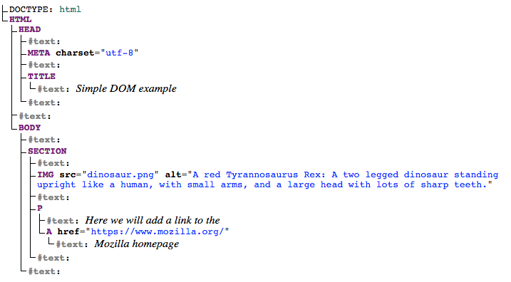

# Client-side web APIs

- When writing client-side JavaScript for web sites or applications, you will quickly encounter **Application Programming Interfaces**(APIs).
- APIs are programming features for manipulating different aspects of the browser and operating system the site is running on, or manipulating data from other web sites or services.
- In this module, we will explore what APIs are, and how to use some of the most common APIs you'll come across often in your development work.

# Introduction to web APIs

- First up, we'll start by looking at APIs from a high level — what are they, how do they work, how to use them in your code, and how are they structured? We'll also take a look at what the different main classes of APIs are, and what kind of uses they have.

## What are APIs?

- Application Programming Interfaces (APIs) are constructs made available in programming languages to allow developers to create complex functionality more easily. They abstract more complex code away from you, providing some easier syntax to use in its place.

- As a real-world example, think about the electricity supply in your house, apartment, or other dwellings. If you want to use an appliance in your house, you plug it into a plug socket and it works. You don't try to wire it directly into the power supply — to do so would be really inefficient and, if you are not an electrician, difficult and dangerous to attempt.

- In the same way, if you want to say, program some 3D graphics, it is a lot easier to do it using an API written in a higher-level language such as JavaScript or Python, rather than try to directly write low-level code (say C or C++) that directly controls the computer's GPU or other graphics functions.

### APIs in client-side JavaScript

- Client-side JavaScript, in particular, has many APIs available to it — these are not part of the JavaScript language itself, rather they are built on top of the core JavaScript language, providing you with extra superpowers to use in your JavaScript code. They generally fall into two categories:
  - **Browser APIs** are built into your web browser and are able to expose data from the browser and surrounding computer environment and do useful complex things with it. For example, the Web Audio API provides JavaScript constructs for manipulating audio in the browser — taking an audio track, altering its volume, applying effects to it, etc. In the background, the browser is actually using some complex lower-level code (e.g. C++ or Rust) to do the actual audio processing. But again, this complexity is abstracted away from you by the API.
  - **Third-party APIs** are not built into the browser by default, and you generally have to retrieve their code and information from somewhere on the Web. For example, the Twitter API allows you to do things like displaying your latest tweets on your website. It provides a special set of constructs you can use to query the Twitter service and return specific information.


### Relationship between JavaScript, APIs, and other JavaScript tools

- So above, we talked about what client-side JavaScript APIs are, and how they relate to the JavaScript language. Let's recap this to make it clearer, and also mention where other JavaScript tools fit in:
  - JavaScript — A high-level scripting language built into browsers that allows you to implement functionality on web pages/apps. Note that JavaScript is also available in other programming environments, such as Node.
  - Browser APIs — constructs built into the browser that sits on top of the JavaScript language and allows you to implement functionality more easily.
  - Third-party APIs — constructs built into third-party platforms (e.g. Twitter, Facebook) that allow you to use some of those platform's functionality in your own web pages (for example, display your latest Tweets on your web page).
  - JavaScript libraries — Usually one or more JavaScript files containing custom functions that you can attach to your web page to speed up or enable writing common functionality. Examples include jQuery, Mootools and React.
  - JavaScript frameworks — The next step up from libraries, JavaScript frameworks (e.g. Angular and Ember) tend to be packages of HTML, CSS, JavaScript, and other technologies that you install and then use to write an entire web application from scratch. The key difference between a library and a framework is **"Inversion of Control"**. When calling a method from a library, the developer is in control. With a framework, the control is inverted: the framework calls the developer's code.

## What can APIs do?

- There are a huge number of APIs available in modern browsers that allow you to do a wide variety of things in your code. You can see this by taking a look at the MDN APIs index page.

### Common browser APIs

- In particular, the most common categories of browser APIs you'll use (and which we'll cover in this module in greater detail) are:
  - **APIs for manipulating documents** loaded into the browser. The most obvious example is the DOM (Document Object Model) API, which allows you to manipulate HTML and CSS — creating, removing and changing HTML, dynamically applying new styles to your page, etc.
    - Every time you see a popup window appear on a page or some new content displayed, for example, that's the DOM in action. Find out more about these types of API in Manipulating documents.
  - **APIs that fetch data from the server** to update small sections of a webpage on their own are very commonly used.
    - This seemingly small detail has had a huge impact on the performance and behavior of sites — if you just need to update a stock listing or list of available new stories, doing it instantly without having to reload the whole entire page from the server can make the site or app feel much more responsive and "snappy".
    - The main API used for this is the _Fetch API_, although older code might still use the `XMLHttpRequest` API. You may also come across the term **Ajax**, which describes this technique. Find out more about such APIs in Fetching data from the server.
  - **APIs for drawing and manipulating graphics** are widely supported in browsers — the most popular ones are _Canvas_ and _WebGL_, which allow you to programmatically update the pixel data contained in an HTML `<canvas>` element to create 2D and 3D scenes.
    - For example, you might draw shapes such as rectangles or circles, import an image onto the canvas, and apply a filter to it such as sepia or grayscale using the Canvas API, or create a complex 3D scene with lighting and textures using WebGL. Such APIs are often combined with APIs for creating animation loops (such as `window.requestAnimationFrame()`) and others to make constantly updating scenes like cartoons and games.
  - **Audio and Video APIs** like `HTMLMediaElement`, the _Web Audio API_, and _WebRTC_ allow you to do really interesting things with multimedia such as creating custom UI controls for playing audio and video, displaying text tracks like captions and subtitles along with your videos, grabbing video from your web camera to be manipulated via a canvas (see above) or displayed on someone else's computer in a web conference, or adding effects to audio tracks (such as gain, distortion, panning, etc.).
  - **Device APIs** enable you to interact with device hardware: for example, accessing the device GPS to find the user's position using the _Geolocation API_.
  - **Client-side storage APIs** enable you to store data on the client-side, so you can create an app that will save its state between page loads, and perhaps even work when the device is offline. There are several options available, e.g. simple name/value storage with the _Web Storage API_, and more complex database storage with the _IndexedDB API_.

### Common third-party APIs

- Third-party APIs come in a large variety; some of the more popular ones that you are likely to make use of sooner or later are:
  - The _Twitter API_, which allows you to do things like displaying your latest tweets on your website.
  - Map APIs, like _Mapquest_ and the _Google Maps API_, which allow you to do all sorts of things with maps on your web pages.
  - The _Facebook suite of APIs_, which enables you to use various parts of the Facebook ecosystem to benefit your app, such as by providing app login using Facebook login, accepting in-app payments, rolling out targeted ad campaigns, etc.
  - The _Telegram APIs_, which allows you to embed content from Telegram channels on your website, in addition to providing support for bots.
  - The _YouTube API_, which allows you to embed YouTube videos on your site, search YouTube, build playlists, and more.
  - The _Pinterest API_, which provides tools to manage Pinterest boards and pins to include them in your website.
  - The _Twilio API_, which provides a framework for building voice and video call functionality into your app, sending SMS/MMS from your apps, and more.
  - The _Mastodon API_, which enables you to manipulate features of the Mastodon social network programmatically.

## How do APIs work?

- Different JavaScript APIs work in slightly different ways, but generally, they have common features and similar themes to how they work.

### They are based on objects

- Your code interacts with APIs using one or more JavaScript objects, which serve as containers for the data the API uses (contained in object properties), and the functionality the API makes available (contained in object methods).

- Let's return to the example of the Web Audio API — this is a fairly complex API, which consists of a number of objects. The most obvious ones are

  - `AudioContext`, which represents an audio graph that can be used to manipulate audio playing inside the browser, and has a number of methods and properties available to manipulate that audio.
  - `MediaElementAudioSourceNode`, which represents an `<audio>` element containing sound you want to play and manipulate inside the audio context.
  - `AudioDestinationNode`, which represents the destination of the audio, i.e. the device on your computer that will actually output it — usually your speakers or headphones.

- So how do these objects interact? If you look at our simple web audio example, you'll first see the following HTML:

```
<audio src="outfoxing.mp3"></audio>

<button class="paused">Play</button>
<br />
<input type="range" min="0" max="1" step="0.01" value="1" class="volume" />
```

- We, first of all, include an `<audio>` element with which we embed an MP3 into the page.
- We don't include any default browser controls.
- Next, we include a `<button>` that we'll use to play and stop the music, and an `<input>` element of type range, which we'll use to adjust the volume of the track while it's playing.

- Next, let's look at the JavaScript for this example.

- We start by creating an `AudioContext` instance inside which to manipulate our track:

```
const AudioContext = window.AudioContext || window.webkitAudioContext;
const audioCtx = new AudioContext();
```

- Next, we create constants that store references to our `<audio>`, `<button>`, and `<input>` elements, and use the `AudioContext.createMediaElementSource()` method to create a `MediaElementAudioSourceNode` representing the source of our audio — the `<audio>` element will be played from:

```
const audioElement = document.querySelector('audio');
const playBtn = document.querySelector('button');
const volumeSlider = document.querySelector('.volume');

const audioSource = audioCtx.createMediaElementSource(audioElement);
```

- Next up we include a couple of event handlers that serve to toggle between play and pause when the button is pressed and reset the display back to the beginning when the song has finished playing:

```
// play/pause audio
playBtn.addEventListener('click', () => {
  // check if context is in suspended state (autoplay policy)
  if (audioCtx.state === 'suspended') {
     audioCtx.resume();
  }

  // if track is stopped, play it
  if (playBtn.getAttribute('class') === 'paused') {
    audioElement.play();
    playBtn.setAttribute('class', 'playing');
    playBtn.textContent = 'Pause'
    // if track is playing, stop it
} else if (playBtn.getAttribute('class') === 'playing') {
    audioElement.pause();
    playBtn.setAttribute('class', 'paused');
    playBtn.textContent = 'Play';
  }
});

// if track ends
audioElement.addEventListener('ended', () => {
  playBtn.setAttribute('class', 'paused');
  playBtn.textContent = 'Play'
});
```

- **Note**: Some of you may notice that the `play()` and `pause()` methods being used to play and pause the track are not part of the Web Audio API; they are part of the `HTMLMediaElement` API, which is different but closely-related.

- Next, we create a `GainNode` object using the `AudioContext.createGain()` method, which can be used to adjust the volume of audio fed through it, and create another event handler that changes the value of the audio graph's gain (volume) whenever the slider value is changed:

```
// volume
const gainNode = audioCtx.createGain();

volumeSlider.addEventListener('input', () => {
  gainNode.gain.value = volumeSlider.value;
});
```

- The final thing to do to get this to work is to connect the different nodes in the audio graph up, which is done using the `AudioNode.connect()` method available on every node type:

```
audioSource.connect(gainNode).connect(audioCtx.destination);
```

- The audio starts in the source, which is then connected to the gain node so the audio's volume can be adjusted. The gain node is then connected to the destination node so the sound can be played on your computer (the `AudioContext.destination` property represents whatever is the default `AudioDestinationNode` available on your computer's hardware, e.g. your speakers).

### They have recognizable entry points

- When using an API, you should make sure you know where the entry point is for the API.

  - In The Web Audio API, this is pretty simple — it is the `AudioContext` object, which needs to be used to do any audio manipulation whatsoever.

- The Document Object Model (DOM) API also has a simple entry point — its features tend to be found hanging off the `Document` object, or an instance of an HTML element that you want to affect in some way, for example:

```
const em = document.createElement('em'); // create a new em element
const para = document.querySelector('p'); // reference an existing p element
em.textContent = 'Hello there!'; // give em some text content
para.appendChild(em); // embed em inside para
```

- The Canvas API also relies on getting a context object to use to manipulate things, although in this case, it's a graphical context rather than an audio context.
  - Its context object is created by getting a reference to the `<canvas>` element you want to draw on, and then calling its `HTMLCanvasElement.getContext()` method:

```
const canvas = document.querySelector('canvas');
const ctx = canvas.getContext('2d');
```

- Anything that we want to do to the canvas is then achieved by calling properties and methods of the context object (which is an instance of `CanvasRenderingContext2D`), for example:

```
Ball.prototype.draw = function() {
  ctx.beginPath();
  ctx.fillStyle = this.color;
  ctx.arc(this.x, this.y, this.size, 0, 2 * Math.PI);
  ctx.fill();
};
```

### They often use events to handle changes in state

- We already discussed events earlier on in the course in our Introduction to events article, which looks in detail at what client-side web events are and how they are used in your code.

- Some web APIs contain no events, but most contain at least a few. The handler properties that allow us to run functions when events fire are generally listed in our reference material in separate "Event handlers" sections.

- We already saw a number of event handlers in use in our Web Audio API example above:

```
// play/pause audio
playBtn.addEventListener('click', () => {
  // check if context is in suspended state (autoplay policy)
  if (audioCtx.state === 'suspended') {
     audioCtx.resume();
  }

  // if track is stopped, play it
  if (playBtn.getAttribute('class') === 'paused') {
    audioElement.play();
    playBtn.setAttribute('class', 'playing');
    playBtn.textContent = 'Pause'
    // if track is playing, stop it
} else if (playBtn.getAttribute('class') === 'playing') {
    audioElement.pause();
    playBtn.setAttribute('class', 'paused');
    playBtn.textContent = 'Play';
  }
});

// if track ends
audioElement.addEventListener('ended', () => {
  playBtn.setAttribute('class', 'paused');
  playBtn.textContent = 'Play'
});
```

### They have additional security mechanisms where appropriate

- WebAPI features are subject to the same security considerations as JavaScript and other web technologies (for example same-origin policy), but they sometimes have additional security mechanisms in place.
- For example, some of the more modern WebAPIs will only work on pages served over HTTPS due to them transmitting potentially sensitive data (examples include Service Workers and Push).

- In addition, some WebAPIs request permission to be enabled from the user once calls to them are made in your code. As an example, the Notifications API asks for permission using a pop-up dialog box:


- The Web Audio and `HTMLMediaElement` APIs are subject to a security mechanism called _autoplay policy_ — this basically means that you can't automatically play audio when a page loads — you've got to allow your users to initiate audio play through a control like a button.
- This is done because autoplaying audio is usually really annoying and we really shouldn't be subjecting our users to it.

- **Note**: Depending on how strict the browser is, such security mechanisms might even stop the example from working locally, i.e. if you load the local example file in your browser instead of running it from a web server. At the time of writing, our Web Audio API example wouldn't work locally on Google Chrome — we had to upload it to GitHub before it would work.

# Manipulating documents

- When writing web pages and apps, one of the most common things you'll want to do is manipulate the document structure in some way.
- This is usually done by using the Document Object Model (DOM), a set of APIs for controlling HTML and styling information that makes heavy use of the `Document` object.
- In this article we'll look at how to use the DOM in detail, along with some other interesting APIs that can alter your environment in interesting ways.

## The important parts of a web browser

- Web browsers are very complicated pieces of software with a lot of moving parts, many of which can't be controlled or manipulated by a web developer using JavaScript.
- You might think that such limitations are a bad thing, but browsers are locked down for good reasons, mostly centering around security.
- Imagine if a web site could get access to your stored passwords or other sensitive information, and log into websites as if it were you?

- Despite the limitations, Web APIs still give us access to a lot of functionality that enable us to do a great many things with web pages.
- There are a few really obvious bits you'll reference regularly in your code — consider the following diagram, which represents the main parts of a browser directly involved in viewing web pages:


- The window is the browser tab that a web page is loaded into; this is represented in JavaScript by the `Window` object.
  - Using methods available on this object you can do things like return the window's size (see `Window.innerWidth` and `Window.innerHeight`), manipulate the document loaded into that window, store data specific to that document on the client-side (for example using a local database or other storage mechanism), attach an event handler to the current window, and more.
- The navigator represents the state and identity of the browser (i.e. the user-agent) as it exists on the web.
  - In JavaScript, this is represented by the `Navigator` object.
  - You can use this object to retrieve things like the user's preferred language, a media stream from the user's webcam, etc.
- The document (represented by the DOM in browsers) is the actual page loaded into the window, and is represented in JavaScript by the `Document` object.

  - You can use this object to return and manipulate information on the HTML and CSS that comprises the document, for example get a reference to an element in the DOM, change its text content, apply new styles to it, create new elements and add them to the current element as children, or even delete it altogether.

- In this article we'll focus mostly on manipulating the document, but we'll show a few other useful bits besides.

## The document object model

- The document currently loaded in each one of your browser tabs is represented by a document object model.
- This is a "tree structure" representation created by the browser that enables the HTML structure to be easily accessed by programming languages — for example the browser itself uses it to apply styling and other information to the correct elements as it renders a page, and developers like you can manipulate the DOM with JavaScript after the page has been rendered.

- We have created a simple example page.
- It is a very simple page containing a `<section>` element inside which you can find an image, and a paragraph with a link inside. The HTML source code looks like this:

```
<!DOCTYPE html>
<html lang="en-US">
  <head>
    <meta charset="utf-8" />
    <title>Simple DOM example</title>
  </head>
  <body>
    <section>
      
      <p>
        Here we will add a link to the
        <a href="https://www.mozilla.org/">Mozilla homepage</a>
      </p>
    </section>
  </body>
</html>
```

- The DOM on the other hand looks like this:



- Each entry in the tree is called a **node**.
- You can see in the diagram above that some nodes represent elements (identified as `HTML`, `HEAD`, `META` and so on) and others represent text (identified as #text).
- There are other types of nodes as well, but these are the main ones you'll encounter.

- Nodes are also referred to by their position in the tree relative to other nodes:

  - **Root node**: The top node in the tree, which in the case of HTML is always the `HTML` node (other markup vocabularies like SVG and custom XML will have different root elements).
  - **Child node**: A node _directly_ inside another node. For example, `IMG` is a child of `SECTION` in the above example.
  - **Descendant node**: A node anywhere inside another node. For example, `IMG` is a child of `SECTION` in the above example, and it is also a descendant. `IMG` is not a child of `BODY`, as it is two levels below it in the tree, but it is a descendant of `BODY`.
  - **Parent node**: A node which has another node inside it. For example, `BODY` is the parent node of `SECTION` in the above example.
  - **Sibling nodes**: Nodes that sit on the same level in the DOM tree. For example, `IMG` and `P` are siblings in the above example.

- It is useful to familiarize yourself with this terminology before working with the DOM, as a number of the code terms you'll come across make use of them. You may have also come across them if you have studied CSS (e.g. descendant selector, child selector).

## Active learning: Basic DOM manipulation

- We will work through another example:

1. Add a `<script></script>` element just above the closing `</body>` tag.
2. To manipulate an element inside the DOM, you first need to select it and store a reference to it inside a variable. Inside your script element, add the following line:

```
const link = document.querySelector('a');
```

4. Now we have the element reference stored in a variable, we can start to manipulate it using properties and methods available to it (these are defined on interfaces like `HTMLAnchorElement` in the case of `<a>` element, its more general parent interface `HTMLElement`, and `Node` — which represents all nodes in a DOM). First of all, let's change the text inside the link by updating the value of the `Node.textContent` property. Add the following line below the previous one:

```
link.textContent = 'Mozilla Developer Network';
```

5. We should also change the URL the link is pointing to, so that it doesn't go to the wrong place when it is clicked on. Add the following line, again at the bottom:

```
link.href = 'https://developer.mozilla.org';
```

- Note that, as with many things in JavaScript, there are many ways to select an element and store a reference to it in a variable.
- `Document.querySelector()` is the recommended modern approach. It is convenient because it allows you to select elements using CSS selectors.
- The above `querySelector()` call will match the first `<a>` element that appears in the document. If you wanted to match and do things to multiple elements, you could use `Document.querySelectorAll()`, which matches every element in the document that matches the selector, and stores references to them in an array-like object called a `NodeList`.

- There are older methods available for grabbing element references, such as:

  - `Document.getElementById()`, which selects an element with a given id attribute value, e.g. `<p id="myId">My paragraph</p>`. The ID is passed to the function as a parameter, i.e. `const elementRef = document.getElementById('myId')`.
  - `Document.getElementsByTagName()`, which returns an array-like object containing all the elements on the page of a given type, for example `<p>`s, `<a>`s, etc.
  - The element type is passed to the function as a parameter, i.e. `const elementRefArray = document.getElementsByTagName('p')`.

- These two work better in older browsers than the modern methods like `querySelector()`, but are not as convenient. Have a look and see what others you can find!

### Creating and placing new nodes

- The above has given you a little taste of what you can do, but let's go further and look at how we can create new elements.

1. Going back to the current example, let's start by grabbing a reference to our `<section>` element — add the following code at the bottom of your existing script (do the same with the other lines too):

```
const sect = document.querySelector('section');
```

2. Now let's create a new paragraph using `Document.createElement()` and give it some text content in the same way as before:

```
const para = document.createElement('p');
para.textContent = 'We hope you enjoyed the ride.';
```

3. You can now append the new paragraph at the end of the section using `Node.appendChild()`:

```
sect.appendChild(para);
```

4. Finally for this part, let's add a text node to the paragraph the link sits inside, to round off the sentence nicely. First we will create the text node using `Document.createTextNode()`:

```
const text = document.createTextNode(' — the premier source for web development knowledge.');
```

5. Now we'll grab a reference to the paragraph the link is inside, and append the text node to it:

- That's most of what you need for adding nodes to the DOM — you'll make a lot of use of these methods when building dynamic interfaces (we'll look at some examples later).

### Moving and removing elements

- There may be times when you want to move nodes, or delete them from the DOM altogether. This is perfectly possible.

- If we wanted to move the paragraph with the link inside it to the bottom of the section, we could do this:

```
sect.appendChild(linkPara);
```

- This moves the paragraph down to the bottom of the section.
- You might have thought it would make a second copy of it, but this is not the case — `linkPara` is a reference to the one and only copy of that paragraph.
- If you wanted to make a copy and add that as well, you'd need to use `Node.cloneNode()` instead.

- Removing a node is pretty simple as well, at least when you have a reference to the node to be removed and its parent. In our current case, we just use `Node.removeChild()`, like this:

```
sect.removeChild(linkPara);
```

- When you want to remove a node based only on a reference to itself, which is fairly common, you can use `Element.remove()`:

```
linkPara.remove();
```

- This method is not supported in older browsers. They have no method to tell a node to remove itself, so you'd have to do the following.

```
linkPara.parentNode.removeChild(linkPara);
```

### Manipulating styles

- It is possible to manipulate CSS styles via JavaScript in a variety of ways.

- To start with, you can get a list of all the stylesheets attached to a document using `Document.stylesheets`, which returns an array-like object with CSSStyleSheet objects.
- You can then add/remove styles as wished.
- However, we're not going to expand on those features because they are a somewhat archaic and difficult way to manipulate style. There are much easier ways.

- The first way is to add inline styles directly onto elements you want to dynamically style. This is done with the `HTMLElement.style` property, which contains inline styling information for each element in the document.
- You can set properties of this object to directly update element styles.

1. As an example, try adding these lines to our ongoing example:

```
para.style.color = 'white';
para.style.backgroundColor = 'black';
para.style.padding = '10px';
para.style.width = '250px';
para.style.textAlign = 'center';
```

2. Reload the page and you'll see that the styles have been applied to the paragraph. If you look at that paragraph in your browser's Page Inspector/DOM inspector, you'll see that these lines are indeed adding inline styles to the document:

```
<p
  style="color: white; background-color: black; padding: 10px; width: 250px; text-align: center;">
  We hope you enjoyed the ride.
</p>
```

- **Note**: Notice how the JavaScript property versions of the CSS styles are written in lower camel case whereas the CSS versions are hyphenated (e.g. `backgroundColor` versus `background-color`). Make sure you don't get these mixed up, otherwise it won't work.

- There is another common way to dynamically manipulate styles on your document, which we'll look at now.

1. Delete the previous five lines you added to the JavaScript.
2. Add the following inside your HTML `<head>`:

```
<style>
  .highlight {
    color: white;
    background-color: black;
    padding: 10px;
    width: 250px;
    text-align: center;
  }
</style>
```

3. Now we'll turn to a very useful method for general HTML manipulation — `Element.setAttribute()` — this takes two arguments, the attribute you want to set on the element, and the value you want to set it to. In this case we will set a class name of highlight on our paragraph:

```
para.setAttribute('class', 'highlight');
```

- Refresh your page, and you'll see no change — the CSS is still applied to the paragraph, but this time by giving it a class that is selected by our CSS rule, not as inline CSS styles.

- Which method you choose is up to you; both have their advantages and disadvantages.
- The first method takes less setup and is good for simple uses, whereas the second method is more purist (no mixing CSS and JavaScript, no inline styles, which are seen as a bad practice).
- As you start building larger and more involved apps, you will probably start using the second method more, but it is really up to you.

- At this point, we haven't really done anything useful!
- There is no point using JavaScript to create static content — you might as well just write it into your HTML and not use JavaScript.
- It is more complex than HTML, and creating your content with JavaScript also has other issues attached to it (such as not being readable by search engines).

## Active learning: A dynamic shopping list

- In this challenge we want to make a simple shopping list example that allows you to dynamically add items to the list using a form input and button. When you add an item to the input and press the button:
  - The item should appear in the list.
  - Each item should be given a button that can be pressed to delete that item off the list.
  - The input should be emptied and focused ready for you to enter another item.

1. To start with, make a copy of the file. You'll see that it has some minimal CSS, a div with a label, input, and button, and an empty list and `<script>` element. You'll be making all your additions inside the script.
2. Create three variables that hold references to the list (`<ul>`), `<input>`, and `<button>` elements.
3. Create a function that will run in response to the button being clicked.
4. Inside the function body, start off by storing the current value of the input element in a variable.
5. Next, empty the input element by setting its value to an empty string — `''`.
6. Create three new elements — a list item (`<li>`), `<span>`, and `<button>`, and store them in variables.
7. Append the span and the button as children of the list item.
8. Set the text content of the span to the input element value you saved earlier, and the text content of the button to `'Delete'`.
9. Append the list item as a child of the list.
10. Attach an event handler to the delete button so that, when clicked, it will delete the entire list item (`<li>...</li>`).
11. Finally, use the `focus()` method to focus the input element ready for entering the next shopping list item.

## Summary

- We have reached the end of our study of document and DOM manipulation. At this point you should understand what the important parts of a web browser are with respect to controlling documents and other aspects of the user's web experience. Most importantly, you should understand what the Document Object Model is, and how to manipulate it to create useful functionality.

## See also

- There are lots more features you can use to manipulate your documents. Check out some of our references and see what you can discover:
  - `Document`
  - `Window`
  - `Node`
  - `HTMLElement`, `HTMLInputElement`, `HTMLImageElement`, etc.

# Fetching data from the server

- Another very common task in modern websites and applications is retrieving individual data items from the server to update sections of a webpage without having to load an entire new page. This seemingly small detail has had a huge impact on the performance and behavior of sites, so in this article, we'll explain the concept and look at technologies that make it possible: in particular, the Fetch API.

## What is the problem here?

- A web page consists of an HTML page and (usually) various other files, such as stylesheets, scripts, and images.
- The basic model of page loading on the Web is that your browser makes one or more HTTP requests to the server for the files needed to display the page, and the server responds with the requested files.
- If you visit another page, the browser requests the new files, and the server responds with them.


- This model works perfectly well for many sites. But consider a website that's very data-driven.
- For example, a library website like the Vancouver Public Library.
- Among other things you could think of a site like this as a user interface to a database.
- It might let you search for a particular genre of book, or might show you recommendations for books you might like, based on books you've previously borrowed.
- When you do this, it needs to update the page with the new set of books to display.
- But note that most of the page content — including items like the page header, sidebar, and footer — stays the same.

- The trouble with the traditional model here is that we'd have to fetch and load the entire page, even when we only need to update one part of it.
- This is inefficient and can result in a poor user experience.

- So instead of the traditional model, many websites use JavaScript APIs to request data from the server and update the page content without a page load.
- So when the user searches for a new product, the browser only requests the data which is needed to update the page — the set of new books to display, for instance.


- The main API here is the Fetch API.
- This enables JavaScript running in a page to make an HTTP request to a server to retrieve specific resources.
- When the server provides them, the JavaScript can use the data to update the page, typically by using DOM manipulation APIs.
- The data requested is often JSON, which is a good format for transferring structured data, but can also be HTML or just text.

- This is a common pattern for data-driven sites such as Amazon, YouTube, eBay, and so on. With this model:

  - Page updates are a lot quicker and you don't have to wait for the page to refresh, meaning that the site feels faster and more responsive.
  - Less data is downloaded on each update, meaning less wasted bandwidth. This may not be such a big issue on a desktop on a broadband connection, but it's a major issue on mobile devices and in countries that don't have ubiquitous fast internet service.

- **Note**: In the early days, this general technique was known as Asynchronous JavaScript and XML (**Ajax**), because it tended to request XML data. This is normally not the case these days (you'd be more likely to request JSON), but the result is still the same, and the term "Ajax" is still often used to describe the technique.

- To speed things up even further, some sites also store assets and data on the user's computer when they are first requested, meaning that on subsequent visits they use the local versions instead of downloading fresh copies every time the page is first loaded. The content is only reloaded from the server when it has been updated.

## The Fetch API

- Let's walk through a couple of examples of the Fetch API.

### Fetching text content

- For this example, we'll request data out of a few different text files and use them to populate a content area.

- This series of files will act as our fake database; in a real application, we'd be more likely to use a server-side language like PHP, Python, or Node to request our data from a database.
- Here, however, we want to keep it simple and concentrate on the client-side part of this.

- To begin this example, make a local copy of fetch-start.html and the four text files — verse1.txt, verse2.txt, verse3.txt, and verse4.txt — in a new directory on your computer. In this example, we will fetch a different verse of the poem (which you may well recognize) when it's selected in the drop-down menu.

- Just inside the `<script>` element, add the following code. This stores references to the `<select>` and `<pre>` elements and adds a listener to the `<select>` element, so that when the user selects a new value, the new value is passed to function named `updateDisplay()` as a parameter.

- A `<pre>` tag defines a preformatted text, displayed in a fixed-width font, and the text preserves both spaces and line breaks.

```
const verseChoose = document.querySelector('select');
const poemDisplay = document.querySelector('pre');

verseChoose.addEventListener('change', () => {
  const verse = verseChoose.value;
  updateDisplay(verse);
});
```

- Let's define our `updateDisplay()` function. First of all, put the following beneath your previous code block — this is the empty shell of the function.

```
function updateDisplay(verse) {

}
```

- We'll start our function by constructing a relative URL pointing to the text file we want to load, as we'll need it later.
- The value of the `<select>` element at any time is the same as the text inside the selected `<option>` (unless you specify a different value in a value attribute) — so for example "Verse 1".
- The corresponding verse text file is "verse1.txt", and is in the same directory as the HTML file, therefore just the file name will do.

- However, web servers tend to be case sensitive, and the file name doesn't have a space in it.
- To convert "Verse 1" to "verse1.txt" we need to convert the V to lower case, remove the space, and add `.txt` on the end. This can be done with `replace()`, `toLowerCase()`, and string concatenation. Add the following lines inside your `updateDisplay()` function:

```
verse = verse.replace(' ', '').toLowerCase();
const url = `${verse}.txt`;
```

- Finally, we're ready to use the Fetch API:

```
// Call `fetch()`, passing in the URL.
fetch(url)
  // fetch() returns a promise. When we have received a response from the server,
  // the promise's `then()` handler is called with the response.
  .then((response) => {
    // Our handler throws an error if the request did not succeed.
    if (!response.ok) {
      throw new Error(`HTTP error: ${response.status}`);
    }
    // Otherwise (if the response succeeded), our handler fetches the response
    // as text by calling response.text(), and immediately returns the promise
    // returned by `response.text()`.
    return response.text();
  })
  // When response.text() has succeeded, the `then()` handler is called with
  // the text, and we copy it into the `poemDisplay` box.
  .then((text) => poemDisplay.textContent = text)
  // Catch any errors that might happen, and display a message
  // in the `poemDisplay` box.
  .catch((error) => poemDisplay.textContent = `Could not fetch verse: ${error}`);
```

- There's quite a lot to unpack in here.

- First, the entry point to the Fetch API is a global function called `fetch()`, that takes the URL as a parameter (it takes another optional parameter for custom settings, but we're not using that here).

- Next, `fetch()` is an asynchronous API which returns a Promise. You'll find that article also talks about the `fetch()` API!

- So because `fetch()` returns a promise, we pass a function into the `then()` method of the returned promise.
- This method will be called when the HTTP request has received a response from the server. In the handler, we check that the request succeeded, and throw an error if it didn't. Otherwise, we call `response.text()`, to get the response body as text.

- It turns out that `response.text()` is also asynchronous, so we return the promise it returns, and pass a function into the `then()` method of this new promise. This function will be called when the response text is ready, and inside it we will update our `<pre>` block with the text.

- Finally, we chain a `catch()` handler at the end, to catch any errors thrown in either of the asynchronous functions we called or their handlers.

- One problem with the example as it stands is that it won't show any of the poem when it first loads. To fix this, add the following two lines at the bottom of your code (just above the closing `</script>` tag) to load verse 1 by default, and make sure the `<select>` element always shows the correct value:

```
updateDisplay('Verse 1');
verseChoose.value = 'Verse 1';
```

### Serving your example from a server

- Modern browsers will not run HTTP requests if you just run the example from a local file. This is because of security restrictions (for more on web security, read Website security).

- To get around this, we need to test the example by running it through a local web server. To find out how to do this, read our guide to setting up a local testing server.

### The can store

- In this example we have created a sample site called The Can Store — it's a fictional supermarket that only sells canned goods. You can find this example live on GitHub, and see the source code.

- By default, the site displays all the products, but you can use the form controls in the left-hand column to filter them by category, or search term, or both.

- There is quite a lot of complex code that deals with filtering the products by category and search terms, manipulating strings so the data displays correctly in the UI, etc.
- We won't discuss all of it in the article, but you can find extensive comments in the code (see `can-script.js`).

- We will, however, explain the Fetch code.

- The first block that uses Fetch can be found at the start of the JavaScript:

```
fetch('products.json')
  .then((response) => {
    if (!response.ok) {
      throw new Error(`HTTP error: ${response.status}`);
    }
    return response.json();
  })
  .then((json) => initialize(json))
  .catch((err) => console.error(`Fetch problem: ${err.message}`));
```

- The `fetch()` function returns a promise.
- If this completes successfully, the function inside the first `.then()` block contains the response returned from the network.

- Inside this function we:

  - check that the server didn't return an error (such as `404 Not Found`). If it did, we throw the error.
  - call `json()` on the response. This will retrieve the data as a JSON object. We return the promise returned by `response.json()`.

- Next we pass a function into the `then()` method of that returned promise.
- This function will be passed an object containing the response data as JSON, which we pass into the `initialize()` function.
- This function which starts the process of displaying all the products in the user interface.

- To handle errors, we chain a `.catch()` block onto the end of the chain.
- This runs if the promise fails for some reason.
- Inside it, we include a function that is passed as a parameter, an `err` object.
- This `err` object can be used to report the nature of the error that has occurred, in this case we do it with a simple `console.log()`.

- However, a complete website would handle this error more gracefully by displaying a message on the user's screen and perhaps offering options to remedy the situation, but we don't need anything more than a simple `console.error()`.

- You can test the failure case yourself:

1. Make a local copy of the example files.
2. Run the code through a web server (as described above, in Serving your example from a server).
3. Modify the path to the file being fetched, to something like 'produc.json' (make sure it is misspelled).
4. Now load the index file in your browser (via `localhost:8000`) and look in your browser developer console. You'll see a message similar to "Fetch problem: HTTP error: 404".

- The second Fetch block can be found inside the `fetchBlob()` function:

```
fetch(url)
  .then((response) => {
    if (!response.ok) {
      throw new Error(`HTTP error: ${response.status}`);
    }
    return response.blob();
  })
  .then((blob) => showProduct(blob, product))
  .catch((err) => console.error(`Fetch problem: ${err.message}`));
```

- This works in much the same way as the previous one, except that instead of using `json()`, we use `blob()`.
- In this case we want to return our response as an image file, and the data format we use for that is **Blob** (the term is an abbreviation of "Binary Large Object" and can basically be used to represent large file-like objects, such as images or video files).

- Once we've successfully received our blob, we pass it into our `showProduct()` function, which displays it.

## The XMLHttpRequest API

- Sometimes, especially in older code, you'll see another API called `XMLHttpRequest` (often abbreviated as "XHR") used to make HTTP requests.
- This predated Fetch, and was really the first API widely used to implement AJAX. We recommend you use Fetch if you can: it's a simpler API and has more features than `XMLHttpRequest`.
- We won't go through an example that uses XMLHttpRequest, but we will show you what the `XMLHttpRequest` version of our first can store request would look like:

```
const request = new XMLHttpRequest();

try {
  request.open('GET', 'products.json');

  request.responseType = 'json';

  request.addEventListener('load', () => initialize(request.response));
  request.addEventListener('error', () => console.error('XHR error'));

  request.send();

} catch (error) {
  console.error(`XHR error ${request.status}`);
}
```

- There are five stages to this:

  1. Create a new `XMLHttpRequest` object.
  2. Call its `open()` method to initialize it.
  3. Add an event listener to its `load` event, which fires when the response has completed successfully. In the listener we call `initialize()` with the data.
  4. Add an event listener to its `error` event, which fires when the request encounters an error.
  5. Send the request.

- We also have to wrap the whole thing in the `try...catch` block, to handle any errors thrown by `open()` or `send()`.

- Hopefully you think the Fetch API is an improvement over this. In particular, see how we have to handle errors in two different places.

# Third Party APIs

- The APIs we've covered so far are built into the browser, but not all APIs are.
- Many large websites and services such as Google Maps, Twitter, Facebook, PayPal, etc. provide APIs allowing developers to make use of their data (e.g. displaying your twitter stream on your blog) or services (e.g. using Facebook login to log in your users).
- This article looks at the difference between browser APIs and 3rd party APIs and shows some typical uses of the latter.

## What are third party APIs?

- Third party APIs are APIs provided by third parties — generally companies such as Facebook, Twitter, or Google — to allow you to access their functionality via JavaScript and use it on your site.
- One of the most obvious examples is using mapping APIs to display custom maps on your pages.

- Let's look at a Simple Mapquest API example, and use it to illustrate how third-party APIs differ from browser APIs.

### They are found on third-party servers

- Browser APIs are built into the browser — you can access them from JavaScript immediately.
- For example, the Web Audio API we saw in the Introductory article is accessed using the native `AudioContext` object. For example:

```
const audioCtx = new AudioContext();
// …
const audioElement = document.querySelector('audio');
// …
const audioSource = audioCtx.createMediaElementSource(audioElement);
// etc.
```

- Third party APIs, on the other hand, are located on third party servers.
- To access them from JavaScript you first need to connect to the API functionality and make it available on your page.
- This typically involves first linking to a JavaScript library available on the server via a `<script>` element, as seen in our Mapquest example:

```
<script
  src="https://api.mqcdn.com/sdk/mapquest-js/v1.3.2/mapquest.js"
  defer></script>
<link
  rel="stylesheet"
  href="https://api.mqcdn.com/sdk/mapquest-js/v1.3.2/mapquest.css" />
```

- You can then start using the objects available in that library. For example:

```
const map = L.mapquest.map('map', {
  center: [53.480759, -2.242631],
  layers: L.mapquest.tileLayer('map'),
  zoom: 12
});
```

- Here we are creating a variable to store the map information in, then creating a new map using the `mapquest.map()` method, which takes as its parameters the ID of a `<div>` element you want to display the map in ('map'), and an options object containing the details of the particular map we want to display.
- In this case we specify the coordinates of the center of the map, a map layer of type map to show (created using the `mapquest.tileLayer()` method), and the default zoom level.

- This is all the information the Mapquest API needs to plot a simple map.
- The server you are connecting to handles all the complicated stuff, like displaying the correct map tiles for the area being shown, etc.

- **Note**: Some APIs handle access to their functionality slightly differently, requiring the developer to make an HTTP request to a specific URL pattern to retrieve data. These are called **RESTful** APIs — we'll show an example later on.

### They usually require API keys

- Security for browser APIs tends to be handled by permission prompts, as discussed in our first article.
- The purpose of these is so that the user knows what is going on in the websites they visit and is less likely to fall victim to someone using an API in a malicious way.

- Third party APIs have a slightly different permissions system — they tend to use developer keys to allow developers access to the API functionality, which is more to protect the API vendor than the user.

- You'll find a line similar to the following in the Mapquest API example:

```
L.mapquest.key = 'YOUR-API-KEY-HERE';
```

- This line specifies an API or developer key to use in your application — the developer of the application must apply to get a key, and then include it in their code to be allowed access to the API's functionality.
- In our example we've just provided a placeholder.

- **Note**: When creating your own examples, you'll use your own API key in place of any placeholder.

- Other APIs may require that you include the key in a slightly different way, but the pattern is relatively similar for most of them.

- Requiring a key enables the API provider to hold users of the API accountable for their actions.
- When the developer has registered for a key, they are then known to the API provider, and action can be taken if they start to do anything malicious with the API (such as tracking people's location or trying to spam the API with loads of requests to stop it working, for example).
- The easiest action would be to just revoke their API privileges.

## Extending the Mapquest example

- Let's add some more functionality to the Mapquest example to show how to use some other features of the API.

  1. To start this section, make yourself a copy of the mapquest starter file, in a new directory. If you've already cloned the examples repository, you'll already have a copy of this file, which you can find in the javascript/apis/third-party-apis/mapquest/start directory.

  2. Next, you need to go to the Mapquest developer site, create an account, and then create a developer key to use with your example. (At the time of writing, it was called a "consumer key" on the site, and the key creation process also asked for an optional "callback URL". You don't need to fill in a URL here: just leave it blank.)

- Open up your starting file, and replace the API key placeholder with your key. **This is kind of cool, I'm assuming this is the normal procedure to using other people's APIs as well.**

### Changing the type of map

- There are a number of different types of map that can be shown with the Mapquest API. To do this, find the following line:

```
layers: L.mapquest.tileLayer('map')
```

- Try changing `'map'` to `'hybrid'` to show a hybrid-style map. Try some other values too. The `tileLayer` reference page shows the different available options, plus a lot more information.

### Adding different controls

- The map has a number of different controls available; by default it just shows a zoom control. You can expand the controls available using the `map.addControl()` method; add this to your code:

```
map.addControl(L.mapquest.control());
```

- The `mapquest.control()` method just creates a simple full-featured control set, and it is placed in the top-right-hand corner by default.
- You can adjust the position by specifying an options object as a parameter for the control containing a position property, the value of which is a string specifying a position for the control. Try this, for example:

```
map.addControl(L.mapquest.control({ position: 'bottomright' }));
```

- There are other types of control available, for example `mapquest.searchControl()` and `mapquest.satelliteControl()`, and some are quite complex and powerful. Have a play around and see what you can come up with.

### Adding a custom marker

- Adding a marker (icon) at a certain point on the map is easy — you just use the `L.marker()` method (which seems to be documented in the related `Leaflet.js` docs). Add the following code to your example, again inside `window.onload`:

```
L.marker([53.480759, -2.242631], {
  icon: L.mapquest.icons.marker({
    primaryColor: '#22407F',
    secondaryColor: '#3B5998',
    shadow: true,
    size: 'md',
    symbol: 'A'
  })
})
.bindPopup('This is Manchester!')
.addTo(map);
```

- As you can see, this at its simplest takes two parameters, an array containing the coordinates at which to display the marker, and an options object containing an icon property that defines the icon to display at that point.

- The icon is defined using an `mapquest.icons.marker()` method, which as you can see contains information such as color and size of marker.

- Onto the end of the first method call we chain `.bindPopup('This is Manchester!')`, which defines content to display when the marker is clicked.

- Finally, we chain `.addTo(map)` to the end of the chain to actually add the marker to the map.

- Have a play with the other options shown in the documentation and see what you can come up with! Mapquest provides some pretty advanced functionality, such as directions, searching, etc.

## A RESTful API — NYTimes

- Now let's look at another API example — the New York Times API. This API allows you to retrieve New York Times news story information and display it on your site.
- This type of API is known as a **RESTful API** — instead of getting data using the features of a JavaScript library like we did with Mapquest, we get data by making HTTP requests to specific URLs, with data like search terms and other properties encoded in the URL (often as URL parameters). This is a common pattern you'll encounter with APIs.

## An approach for using third-party APIs

- Below we'll take you through an exercise to show you how to use the NYTimes API, which also provides a more general set of steps to follow that you can use as an approach for working with new APIs.

### Find the documentation

- When you want to use a third party API, it is essential to find out where the documentation is, so you can find out what features the API has, how you use them, etc.
- The New York Times API documentation is at https://developer.nytimes.com/.

### Get a developer key

- Most APIs require you to use some kind of developer key, for reasons of security and accountability. To sign up for an NYTimes API key, following the instructions at https://developer.nytimes.com/get-started.

  1. Let's request a key for the Article Search API — create a new app, selecting this as the API you want to use (fill in a name and description, toggle the switch under the "Article Search API" to the on position, and then click "Create").
  2. Get the API key from the resulting page.
  3. Now, go to the `ThirdPartyNYTimes` folder. Initially the `script.js` file contains a number of variables needed for the setup of the example; below we'll fill in the required functionality.

- The app will end up allowing you to type in a search term and optional start and end dates, which it will then use to query the Article Search API and display the search results.

### Connect the API to your app

- First, you'll need to make a connection between the API and your app. In the case of this API, you need to include the API key as a get parameter every time you request data from the service at the correct URL.

1. Find the following line:

```
const key = 'INSERT-YOUR-API-KEY-HERE';
```

- Replace the existing API key with the actual API key you got in the previous section.

2. Add the following line to your JavaScript, below the `"// Event listeners to control the functionality"` comment. This runs a function called `submitSearch()` when the form is submitted (the button is pressed).

```
searchForm.addEventListener('submit', submitSearch);
```

3. Now add the `submitSearch()` and `fetchResults()` function definitions, below the previous line:

```
function submitSearch(e) {
  pageNumber = 0;
  fetchResults(e);
}

function fetchResults(e) {
  // Use preventDefault() to stop the form submitting
  e.preventDefault();

  // Assemble the full URL
  let url = `${baseURL}?api-key=${key}&page=${pageNumber}&q=${searchTerm.value}&fq=document_type:("article")`;

  if (startDate.value !== '') {
    url = `${url}&begin_date=${startDate.value}`;
  };

  if (endDate.value !== '') {
    url = `${url}&end_date=${endDate.value}`;
  };
}
```

- `submitSearch()` sets the page number back to 0 to begin with, then calls `fetchResults()`.
- This first calls `preventDefault()` on the event object, to stop the form actually submitting (which would break the example).
- Next, we use some string manipulation to assemble the full URL that we will make the request to.
- We start off by assembling the parts we deem as mandatory for this demo:

  - The base URL (taken from the baseURL variable).
  - The API key, which has to be specified in the `api-key` URL parameter (the value is taken from the `key` variable).
  - The page number, which has to be specified in the `page` URL parameter (the value is taken from the `pageNumber` variable).
  - The search term, which has to be specified in the `q` URL parameter (the value is taken from the value of the `searchTerm` text `<input>`).
  - The document type to return results for, as specified in an expression passed in via the `fq` URL parameter. In this case, we want to return articles.

- Next, we use a couple of `if ()` statements to check whether the `startDate` and `endDate` elements have had values filled in on them. If they do, we append their values to the URL, specified in `begin_date` and `end_date` URL parameters respectively.

- So, a complete URL would end up looking something like this:

```
https://api.nytimes.com/svc/search/v2/articlesearch.json?api-key=YOUR-API-KEY-HERE&page=0&q=cats&fq=document_type:("article")&begin_date=20170301&end_date=20170312
```

- **Note**: The example has rudimentary form data validation — the search term field has to be filled in before the form can be submitted (achieved using the `required` attribute), and the date fields have `pattern` attributes specified, which means they won't submit unless their values consist of 8 numbers (`pattern="[0-9]{8}"`). See Form data validation for more details on how these work.

### Requesting data from the API

- Now we've constructed our URL, let's make a request to it. We'll do this using the Fetch API.

- Add the following code block inside the `fetchResults()` function, just above the closing curly brace:

```
// Use fetch() to make the request to the API
fetch(url)
  .then((response) => response.json())
  .then((json) => displayResults(json))
  .catch((error) => console.error(`Error fetching data: ${error.message}`));
```

- Here we run the request by passing our url variable to `fetch()`, convert the response body to JSON using the `json()` function, then pass the resulting JSON to the `displayResults()` function so the data can be displayed in our UI. We also catch and log any errors that might be thrown.

### Displaying the data

- OK, let's look at how we'll display the data. Add the following function below your `fetchResults()` function.

```
function displayResults(json) {
  while (section.firstChild) {
    section.removeChild(section.firstChild);
  }

  const articles = json.response.docs;

  nav.style.display = articles.length === 10 ? 'block' : 'none';

  if (articles.length === 0) {
    const para = document.createElement('p');
    para.textContent = 'No results returned.'
    section.appendChild(para);
  } else {
    for (const current of articles) {
      const article = document.createElement('article');
      const heading = document.createElement('h2');
      const link = document.createElement('a');
      const img = document.createElement('img');
      const para1 = document.createElement('p');
      const keywordPara = document.createElement('p');
      keywordPara.classList.add('keywords');

      console.log(current);

      link.href = current.web_url;
      link.textContent = current.headline.main;
      para1.textContent = current.snippet;
      keywordPara.textContent = 'Keywords: ';
      for (const keyword of current.keywords) {
        const span = document.createElement('span');
        span.textContent = `${keyword.value} `;
        keywordPara.appendChild(span);
      }

      if (current.multimedia.length > 0) {
        img.src = `http://www.nytimes.com/${current.multimedia[0].url}`;
        img.alt = current.headline.main;
      }

      article.appendChild(heading);
      heading.appendChild(link);
      article.appendChild(img);
      article.appendChild(para1);
      article.appendChild(keywordPara);
      section.appendChild(article);
    }
  }
};
```

- There's a lot of code here; let's explain it step by step:
  - The `while` loop is a common pattern used to delete all of the contents of a DOM element, in this case, the `<section>` element. We keep checking to see if the `<section>` has a first child, and if it does, we remove the first child. The loop ends when `<section>` no longer has any children.
  - Next, we set the articles variable to equal `json.response.docs` — this is the array holding all the objects that represent the articles returned by the search. This is done purely to make the following code a bit simpler.
  - The first `if ()` block checks to see if 10 articles are returned (the API returns up to 10 articles at a time.) If so, we display the `<nav>` that contains the _Previous 10/Next 10_ pagination buttons. If fewer than 10 articles are returned, they will all fit on one page, so we don't need to show the pagination buttons. We will wire up the pagination functionality in the next section.
  - The next `if ()` block checks to see if no articles are returned. If so, we don't try to display any — we create a `<p>` containing the text "No results returned." and insert it into the `<section>`.
  - If some articles are returned, we, first of all, create all the elements that we want to use to display each news story, insert the right contents into each one, and then insert them into the DOM at the appropriate places. To work out which properties in the article objects contained the right data to show, we consulted the Article Search API reference (see NYTimes APIs). Most of these operations are fairly obvious, but a few are worth calling out:
    - We used a `for...of` loop to go through all the keywords associated with each article, and insert each one inside its own `<span>`, inside a `<p>`. This was done to make it easy to style each one.
    - We used an `if ()` block (`if (current.multimedia.length > 0) { }`) to check whether each article has any images associated with it, as some stories don't. We display the first image only if it exists; otherwise, an error would be thrown.

### Wiring up the pagination buttons

- To make the pagination buttons work, we will increment (or decrement) the value of the `pageNumber` variable, and then re-rerun the fetch request with the new value included in the page URL parameter.
- This works because the NYTimes API only returns 10 results at a time — if more than 10 results are available, it will return the first 10 (0-9) if the page URL parameter is set to 0 (or not included at all — 0 is the default value), the next 10 (10-19) if it is set to 1, and so on.

- This allows us to write a simplistic pagination function.

1. Below the existing `addEventListener()` call, add these two new ones, which cause the `nextPage()` and `previousPage()` functions to be invoked when the relevant buttons are clicked:

```
nextBtn.addEventListener('click', nextPage);
previousBtn.addEventListener('click', previousPage);
```

2. Below your previous addition, let's define the two functions — add this code now:

```
function nextPage(e) {
  pageNumber++;
  fetchResults(e);
};

function previousPage(e) {
  if (pageNumber > 0) {
    pageNumber--;
  } else {
    return;
  }
  fetchResults(e);
};
```

- The first function increments the pageNumber variable, then run the `fetchResults()` function again to display the next page's results.
- The second function works nearly exactly the same way in reverse, but we also have to take the extra step of checking that `pageNumber` is not already zero before decrementing it — if the fetch request runs with a minus `page` URL parameter, it could cause errors. If the `pageNumber` is already 0, we `return` out of the function — if we are already at the first page, we don't need to load the same results again.

## YouTube example

- There's another example worth checking out.

- This uses two related APIs:

  - The YouTube Data API to search for YouTube videos and return results.
  - The YouTube IFrame Player API to display the returned video examples inside IFrame video players so you can watch them.

- This example is interesting because it shows two related third-party APIs being used together to build an app. The first one is a RESTful API, while the second one works more like Mapquest (with API-specific methods, etc.). It is worth noting however that both of the APIs require a JavaScript library to be applied to the page. The RESTful API has functions available to handle making the HTTP requests and returning the results.

- We are not going to say too much more about this example in the article — the source code has detailed comments inserted inside it to explain how it works.

- To get it running, you'll need to:
  - Read the YouTube Data API Overview documentation.
  - Make sure you visit the Enabled APIs page, and in the list of APIs, make sure the status is ON for the YouTube Data API v3.
  - Get an API key from Google Cloud.
  - Find the string `ENTER-API-KEY-HERE` in the source code, and replace it with your API key.
  - Run the example through a web server. It won't work if you just run it directly in the browser (i.e. via a `file://` URL)

# Drawing graphics

- The browser contains some very powerful graphics programming tools, from the Scalable Vector Graphics (SVG) language, to APIs for drawing on HTML `<canvas>` elements, (see The Canvas API and WebGL).
- This article provides an introduction to canvas, and further resources to allow you to learn more.

## Graphics on the Web

- As we talked about in our HTML Multimedia and embedding module, the Web was originally just text, which was very boring, so images were introduced — first via the `` element and later via CSS properties such as `background-image`, and SVG.

- This however was still not enough.
- While you could use CSS and JavaScript to animate (and otherwise manipulate) SVG vector images — as they are represented by markup — there was still no way to do the same for bitmap images, and the tools available were rather limited.
- The Web still had no way to effectively create animations, games, 3D scenes, and other requirements commonly handled by lower level languages such as C++ or Java.

- The situation started to improve when browsers began to support the `<canvas>` element and associated Canvas API in 2004.
- As you'll see below, canvas provides some useful tools for creating 2D animations, games, data visualizations, and other types of applications, especially when combined with some of the other APIs the web platform provides, but can be difficult or impossible to make accessible.

- We made a bouncing ball example before using the `<canvas>` element.

- Around 2006–2007, Mozilla started work on an experimental 3D canvas implementation. This became WebGL, which gained traction among browser vendors, and was standardized around 2009–2010. WebGL allows you to create real 3D graphics inside your web browser.

- This article will focus mainly on 2D canvas, as raw WebGL code is very complex. We will however show how to use a WebGL library to create a 3D scene more easily, and you can find a tutorial covering raw WebGL elsewhere — see Getting started with WebGL.

## Active learning: Getting started with a `<canvas>`

- If you want to create a 2D or 3D scene on a web page, you need to start with an HTML `<canvas>` element.
- This element is used to define the area on the page into which the image will be drawn. This is as simple as including the element on the page:

```
<canvas width="320" height="240"></canvas>
```

- This will create a canvas on the page with a size of 320 by 240 pixels.

- You should put some fallback content inside the `<canvas>` tags.
- This should describe the canvas content to users of browsers that don't support canvas, or users of screen readers.

```
<canvas width="320" height="240">
  <p>Description of the canvas for those unable to view it.</p>
</canvas>
```

- The fallback should provide useful alternative content to the canvas content.
- For example, if you are rendering a constantly updating graph of stock prices, the fallback content could be a static image of the latest stock graph, with alt text saying what the prices are in text or a list of links to individual stock pages.

- **Note**: Canvas content is not accessible to screen readers. Include descriptive text as the value of the `aria-label` attribute directly on the canvas element itself or include fallback content placed within the opening and closing `<canvas>` tags. Canvas content is not part of the DOM, but nested fallback content is.

## Creating and sizing our canvas

- Let's start by creating our own canvas that we draw future experiments on to.

1. We will work in the `Canvas` directory
2. Add the following to `index.html`

```
<canvas class="myCanvas">
  <p>Add suitable fallback here.</p>
</canvas>
```

We have added a class to the `<canvas>` element so it will be easier to select if we have multiple canvases on the page, but we have removed the `width` and `height` attributes for now (you could add them back in if you wanted, but we will set them using JavaScript in a below section). Canvases with no explicit width and height default to 300 pixels wide by 150 pixels high.

3. Now open "script.js" and add the following lines of JavaScript:

```
const canvas = document.querySelector(".myCanvas");
const width = canvas.width = window.innerWidth;
const height = canvas.height = window.innerHeight;
```

- Here we have stored a reference to the canvas in the `canvas` constant.
- In the second line we set both a new constant `width` and the canvas' `width` property equal to `Window.innerWidth` (which gives us the viewport width).
- In the third line we set both a new constant `height` and the canvas' `height` property equal to `Window.innerHeight` (which gives us the viewport height).
- So now we have a canvas that fills the entire width and height of the browser window!
- You'll also see that we are chaining assignments together with multiple equals signs — this is allowed in JavaScript, and it is a good technique if you want to make multiple variables all equal to the same value.
- We wanted to make the canvas width and height easily accessible in the width/height variables, as they are useful values to have available for later (for example, if you want to draw something exactly halfway across the width of the canvas).

- **Note**: You should generally set the size of the image using HTML attributes or DOM properties, as explained above. You could use CSS, but the trouble then is that the sizing is done after the canvas has rendered, and just like any other image (the rendered canvas is just an image), the image could become pixelated/distorted.

## Getting the canvas context and final setup

- We need to do one final thing before we can consider our canvas template finished.
- To draw onto the canvas we need to get a special reference to the drawing area called a _context_.
- This is done using the `HTMLCanvasElement.getContext()` method, which for basic usage takes a single string as a parameter representing the type of context you want to retrieve.

- In this case we want a 2d canvas, so add the following JavaScript line below the others in "script.js":

```
const ctx = canvas.getContext("2d");
```

- **Note**: other context values you could choose include `webgl` for WebGL, `webgl2` for WebGL 2, etc., but we won't need those in this article.

- So that's it — our canvas is now primed and ready for drawing on! The `ctx` variable now contains a `CanvasRenderingContext2D` object, and all drawing operations on the canvas will involve manipulating this object.

- Let's do one last thing before we move on. We'll color the canvas background black to give you a first taste of the canvas API. Add the following lines at the bottom of your JavaScript:

```
ctx.fillStyle = "rgb(0, 0, 0)";
ctx.fillRect(0, 0, width, height);
```

- Here we are setting a fill color using the canvas' `fillStyle` property (this takes color values just like CSS properties do), then drawing a rectangle that covers the entire area of the canvas with the `fillRect` method (the first two parameters are the coordinates of the rectangle's top left-hand corner; the last two are the width and height you want the rectangle drawn at — we told you those `width` and `height` variables would be useful)!

- OK, our template is done and it's time to move on.

## 2D canvas basics

- As we said above, all drawing operations are done by manipulating a `CanvasRenderingContext2D` object (in our case, `ctx`).
- Many operations need to be given coordinates to pinpoint exactly where to draw something — the top left of the canvas is point (0, 0), the horizontal (x) axis runs from left to right, and the vertical (y) axis runs from top to bottom.


- Drawing shapes tends to be done using the rectangle shape primitive, or by tracing a line along a certain path and then filling in the shape. Below we'll show how to do both.

### Simple rectangles

- Let's start with some simple rectangles.

1. First of all, take a copy of your newly coded canvas template (or make a local copy of the 1_canvas_template directory if you didn't follow the above steps).

2. Next, add the following lines to the bottom of your JavaScript:

```
ctx.fillStyle = "rgb(255, 0, 0)";
ctx.fillRect(50, 50, 100, 150);
```

- If you save and refresh, you should see a red rectangle has appeared on your canvas. Its top left corner is 50 pixels away from the top and left of the canvas edge (as defined by the first two parameters), and it is 100 pixels wide and 150 pixels tall (as defined by the third and fourth parameters).

3. Let's add another rectangle into the mix — a green one this time. Add the following at the bottom of your JavaScript:

```
ctx.fillStyle = "rgb(0, 255, 0)";
ctx.fillRect(75, 75, 100, 100);
```

- Save and refresh, and you'll see your new rectangle. This raises an important point: graphics operations like drawing rectangles, lines, and so forth are performed in the order in which they occur.
- Think of it like painting a wall, where each coat of paint overlaps and may even hide what's underneath. You can't do anything to change this, so you have to think carefully about the order in which you draw the graphics.

4. Note that you can draw semi-transparent graphics by specifying a semi-transparent color, for example by using `rgba()`. The `a` value defines what's called the "alpha channel, " or the amount of transparency the color has. The higher its value, the more it will obscure whatever's behind it. Add the following to your code:

```
ctx.fillStyle = "rgba(255, 0, 255, 0.75)";
ctx.fillRect(25, 100, 175, 50);
```

### Strokes and line widths

- So far we've looked at drawing filled rectangles, but you can also draw rectangles that are just outlines (called **strokes** in graphic design).
- To set the color you want for your stroke, you use the `strokeStyle` property; drawing a stroke rectangle is done using `strokeRect`.

1. Add the following to the previous example, again below the previous JavaScript lines:

```
ctx.strokeStyle = "rgb(255, 255, 255)";
ctx.strokeRect(25, 25, 175, 200);
```

2. The default width of strokes is 1 pixel; you can adjust the `lineWidth` property value to change this (it takes a number representing the number of pixels wide the stroke is). Add the following line in between the previous two lines:

```
ctx.lineWidth = 5;
```

- Now you should see that your white outline has become much thicker!

### Drawing paths

- If you want to draw anything more complex than a rectangle, you need to draw a path.
- Basically, this involves writing code to specify exactly what path the pen should move along on your canvas to trace the shape you want to draw. Canvas includes functions for drawing straight lines, circles, Bézier curves, and more.

- Let's start the section off by making a fresh copy of our canvas template (1_canvas_template), in which to draw the new example.

- We'll be using some common methods and properties across all of the below sections:

  - `beginPath()` — start drawing a path at the point where the pen currently is on the canvas. On a new canvas, the pen starts out at (0, 0).
  - `moveTo()` — move the pen to a different point on the canvas, without recording or tracing the line; the pen "jumps" to the new position.
  - `fill()` — draw a filled shape by filling in the path you've traced so far.
  - `stroke()` — draw an outline shape by drawing a stroke along the path you've drawn so far.
  - You can also use features like `lineWidth` and `fillStyle`/`strokeStyle` with paths as well as rectangles.

- A typical, simple path-drawing operation would look something like so:

```
ctx.fillStyle = "rgb(255, 0, 0)";
ctx.beginPath();
ctx.moveTo(50, 50);
// draw your path
ctx.fill();
```

### Drawing lines

- Let's draw an equilateral triangle on the canvas.

1. First of all, add the following helper function to the bottom of your code. This converts degree values to radians, which is useful because whenever you need to provide an angle value in JavaScript, it will nearly always be in radians, but humans usually think in degrees.

```
function degToRad(degrees) {
  return degrees * Math.PI / 180;
}
```

2. Next, start off your path by adding the following below your previous addition; here we set a color for our triangle, start drawing a path, and then move the pen to (50, 50) without drawing anything. That's where we'll start drawing our triangle.

```
ctx.fillStyle = "rgb(255, 0, 0)";
ctx.beginPath();
ctx.moveTo(50, 50);
```

3. Now add the following lines at the bottom of your script:

```
ctx.lineTo(150, 50);
const triHeight = 50 \* Math.tan(degToRad(60));
ctx.lineTo(100, 50 + triHeight);
ctx.lineTo(50, 50);
ctx.fill();
```

- Let's run through this in order: First we draw a line across to (150, 50) — our path now goes 100 pixels to the right along the x axis.
- Second, we work out the height of our equilateral triangle, using a bit of simple trigonometry.
- Basically, we are drawing the triangle pointing downwards. The angles in an equilateral triangle are always 60 degrees; to work out the height we can split it down the middle into two right-angled triangles, which will each have angles of 90 degrees, 60 degrees, and 30 degrees.
- In terms of the sides:

  - The longest side is called the **hypotenuse**
  - The side next to the 60 degree angle is called the **adjacent** — which we know is 50 pixels, as it is half of the line we just drew.
  - The side opposite the 60 degree angle is called the **opposite**, which is the height of the triangle we want to calculate.

- One of the basic trigonometric formula states that the length of the adjacent multiplied by the tangent of the angle is equal to the opposite, hence we come up with `50 * Math.tan(degToRad(60))`.
- We use our `degToRad()` function to convert 60 degrees to radians, as `Math.tan()` expects an input value in radians.

4. With the height calculated, we draw another line to (100, 50 + triHeight). The X coordinate is simple; it must be halfway between the previous two X values we set. The Y value on the other hand must be 50 plus the triangle height, as we know the top of the triangle is 50 pixels from the top of the canvas.
5. The next line draws a line back to the starting point of the triangle.
6. Last of all, we run `ctx.fill()` to end the path and fill in the shape.

### Drawing circles

- Now let's look at how to draw a circle in canvas. This is accomplished using the `arc()` method, which draws all or part of a circle at a specified point.

1. Let's add an arc to our canvas — add the following to the bottom of your code:

```
ctx.fillStyle = "rgb(0, 0, 255)";
ctx.beginPath();
ctx.arc(150, 106, 50, degToRad(0), degToRad(360), false);
ctx.fill();
```

- `arc()` takes six parameters.
- The first two specify the position of the arc's center (X and Y, respectively).
- The third is the circle's radius, the fourth and fifth are the start and end angles at which to draw the circle (so specifying 0 and 360 degrees gives us a full circle), and the sixth parameter defines whether the circle should be drawn counterclockwise (anticlockwise) or clockwise (`false` is clockwise).

- **Note**: 0 degrees is horizontally to the right.

2. Let's try adding another arc:

```
ctx.fillStyle = "yellow";
ctx.beginPath();
ctx.arc(200, 106, 50, degToRad(-45), degToRad(45), true);
ctx.lineTo(200, 106);
ctx.fill();
```

- The pattern here is very similar, but with two differences:
  - We have set the last parameter of `arc()` to true, meaning that the arc is drawn counterclockwise, which means that even though the arc is specified as starting at -45 degrees and ending at 45 degrees, we draw the arc around the 270 degrees not inside this portion.
    - If you were to change `true` to `false` and then re-run the code, only the 90 degree slice of the circle would be drawn.
  - Before calling `fill()`, we draw a line to the center of the circle. This means that we get the rather nice Pac-Man-style cutout rendered.
    - If you removed this line (try it!) then re-ran the code, you'd get just an edge of the circle chopped off between the start and end point of the arc.
    - This illustrates another important point of the canvas — if you try to fill an incomplete path (i.e. one that is not closed), the browser fills in a straight line between the start and end point and then fills it in.

### Text

- Canvas also has features for drawing text. Let's explore these briefly. Start by making another fresh copy of our canvas template in which to draw the new example (we'll just do this in the same file).

- Text is drawn using two methods:

  - `fillText()` — draws filled text.
  - `strokeText()` — draws outline (stroke) text.

- Both of these take three properties in their basic usage: the text string to draw and the X and Y coordinates of the point to start drawing the text at.
- This works out as the **bottom left** corner of the **text box** (literally, the box surrounding the text you draw), which might confuse you as other drawing operations tend to start from the top left corner — bear this in mind.

- There are also a number of properties to help control text rendering such as `font`, which lets you specify font family, size, etc. It takes as its value the same syntax as the CSS `font` property.

- Canvas content is not accessible to screen readers.
- Text painted to the canvas is not available to the DOM, but must be made available to be accessible.
- In this example, we include the text as the value for `aria-label`.

- Try adding the following block to the bottom of your JavaScript:

```
ctx.strokeStyle = "white";
ctx.lineWidth = 1;
ctx.font = "36px arial";
ctx.strokeText("Canvas text", 50, 50);

ctx.fillStyle = "red";
ctx.font = "48px georgia";
ctx.fillText("Canvas text", 50, 150);

canvas.setAttribute("aria-label", "Canvas text");
```

### Drawing images onto canvas

- It is possible to render external images onto your canvas. These can be simple images, frames from videos, or the content of other canvases. For the moment we'll just look at the case of using some simple images on our canvas.

1. As before, make another fresh copy of our canvas template in which to draw the new example. Images are drawn onto canvas using the `drawImage()` method. The simplest version takes three parameters — a reference to the image you want to render, and the X and Y coordinates of the image's top left corner.
2. Let's start by getting an image source to embed in our canvas. Add the following lines to the bottom of your JavaScript:

```
const image = new Image();
image.src = "firefox.png";
```

- Here we create a new `HTMLImageElement` object using the `Image()` constructor. The returned object is the same type as that which is returned when you grab a reference to an existing `` element. We then set its `src` attribute to equal our Firefox logo image. At this point, the browser starts loading the image.

3. We could now try to embed the image using `drawImage()`, but we need to make sure the image file has been loaded first, otherwise the code will fail. We can achieve this using the load event, which will only be fired when the image has finished loading. Add the following block below the previous one:

```
image.addEventListener("load", () => ctx.drawImage(image, 20, 20));
```

- If you load your example in the browser now, you should see the image embedded in the canvas.

4. But there's more! What if we want to display only a part of the image, or to resize it? We can do both with the more complex version of `drawImage()`. Update your `ctx.drawImage()` line like so:

```
ctx.drawImage(image, 20, 20, 185, 175, 50, 50, 185, 175);
```

- The first parameter is the image reference, as before.
- Parameters 2 and 3 define the coordinates of the top left corner of the area you want to cut out of the loaded image, relative to the top-left corner of the image itself. Nothing to the left of the first parameter or above the second will be drawn.
- Parameters 4 and 5 define the width and height of the area we want to cut out from the original image we loaded.
- Parameters 6 and 7 define the coordinates at which you want to draw the top-left corner of the cut-out portion of the image, relative to the top-left corner of the canvas.
- Parameters 8 and 9 define the width and height to draw the cut-out area of the image. In this case, we have specified the same dimensions as the original slice, but you could resize it by specifying different values.

5. When the image is meaningfully updated, the accessible description must also be updated.

```
canvas.setAttribute("aria-label", "Firefox Logo");
```

## Loops and animations

- We have so far covered some very basic uses of 2D canvas, but really you won't experience the full power of canvas unless you update or animate it in some way.
- After all, canvas does provide scriptable images! If you aren't going to change anything, then you might as well just use static images and save yourself all the work.

### Creating a loop

- Playing with loops in canvas is rather fun — you can run canvas commands inside a for (or other type of) loop just like any other JavaScript code.

- Let's build a simple example.

1. Make another fresh copy of our canvas template (1_canvas_template) and open it in your code editor.
2. Add the following line to the bottom of your JavaScript. This contains a new method, `translate()`, which moves the origin point of the canvas:

```
ctx.translate(width / 2, height / 2);
```

- This causes the coordinate origin (0, 0) to be moved to the center of the canvas, rather than being at the top left corner. This is very useful in many situations, like this one, where we want our design to be drawn relative to the center of the canvas.

3. Now add the following code to the bottom of the JavaScript:

```
function degToRad(degrees) {
  return degrees * Math.PI / 180;
}

function rand(min, max) {
  return Math.floor(Math.random() * (max - min + 1)) + min;
}

let length = 250;
let moveOffset = 20;

for (let i = 0; i < length; i++) {}
```

- Here we are implementing the same `degToRad()` function we saw in the triangle example above, a `rand()` function that returns a random number between given lower and upper bounds, `length` and `moveOffset` variables (which we'll find out more about later), and an empty `for` loop.

4. The idea here is that we'll draw something on the canvas inside the `for` loop, and iterate on it each time so we can create something interesting. Add the following code inside your `for` loop:

```
ctx.fillStyle = `rgba(${255 - length},0,${255 - length},0.9)`;
ctx.beginPath();
ctx.moveTo(moveOffset, moveOffset);
ctx.lineTo(moveOffset + length, moveOffset);
const triHeight = length / 2 * Math.tan(degToRad(60));
ctx.lineTo(moveOffset + length / 2, moveOffset + triHeight);
ctx.lineTo(moveOffset, moveOffset);
ctx.fill();

length--;
moveOffset += 0.7;
ctx.rotate(degToRad(5));
```

- So on each iteration, we:
  - Set the `fillStyle` to be a shade of slightly transparent purple, which changes each time based on the value of length. As you'll see later the length gets smaller each time the loop runs, so the effect here is that the color gets brighter with each successive triangle drawn.
  - Begin the path.
  - Move the pen to a coordinate of `(moveOffset, moveOffset)`; This variable defines how far we want to move each time we draw a new triangle.
  - Draw a line to a coordinate of `(moveOffset+length, moveOffset)`. This draws a line of length `length` parallel to the X axis.
  - Calculate the triangle's height, as before.
  - Draw a line to the downward-pointing corner of the triangle, then draw a line back to the start of the triangle.
  - Call `fill()` to fill in the triangle.
  - Update the variables that describe the sequence of triangles, so we can be ready to draw the next one. We decrease the length value by 1, so the triangles get smaller each time; increase moveOffset by a small amount so each successive triangle is slightly further away, and use another new function, `rotate()`, which allows us to rotate the entire canvas! We rotate it by 5 degrees before drawing the next triangle.
- That's it! The final example should look like so:

### Animations

- The loop example we built above was fun, but really you need a constant loop that keeps going and going for any serious canvas applications (such as games and real time visualizations).
- If you think of your canvas as being like a movie, you really want the display to update on each frame to show the updated view, with an ideal refresh rate of 60 frames per second so that movement appears nice and smooth to the human eye.

- There are a few JavaScript functions that will allow you to run functions repeatedly, several times a second, the best one for our purposes here being `window.requestAnimationFrame()`.
- It takes one parameter — the name of the function you want to run for each frame.
- The next time the browser is ready to update the screen, your function will get called.
- If that function draws the new update to your animation, then calls `requestAnimationFrame()` again just before the end of the function, the animation loop will continue to run. The loop ends when you stop calling `requestAnimationFrame()` or if you call `window.cancelAnimationFrame()` after calling `requestAnimationFrame()` but before the frame is called.

- **Note**: It's good practice to call cancelAnimationFrame() from your main code when you're done using the animation, to ensure that no updates are still waiting to be run.

- The browser works out complex details such as making the animation run at a consistent speed, and not wasting resources animating things that can't be seen.

- To see how it works, let's quickly look again at our Bouncing Balls example (see it live, and also see the source code). The code for the loop that keeps everything moving looks like this:

```
function loop() {
  ctx.fillStyle = "rgba(0, 0, 0, 0.25)";
  ctx.fillRect(0, 0, width, height);

  for (const ball of balls) {
    ball.draw();
    ball.update();
    ball.collisionDetect();
  }

  requestAnimationFrame(loop);
}

loop();
```

- We run the `loop()` function once at the bottom of the code to start the cycle, drawing the first animation frame; the `loop()` function then takes charge of calling `requestAnimationFrame(loop)` to run the next frame of the animation, again and again.

- Note that on each frame we are completely clearing the canvas and redrawing everything.
- For every ball present we draw it, update its position, and check to see if it is colliding with any other balls.
- Once you've drawn a graphic to a canvas, there's no way to manipulate that graphic individually like you can with DOM elements.
- You can't move each ball around on the canvas, because once it's drawn, it's part of the canvas, and is not an individual accessible element or object.
- Instead, you have to erase and redraw, either by erasing the entire frame and redrawing everything, or by having code that knows exactly what parts need to be erased and only erases and redraws the minimum area of the canvas necessary.

- Optimizing animation of graphics is an entire specialty of programming, with lots of clever techniques available.
- Those are beyond what we need for our example, though!

- In general, the process of doing a canvas animation involves the following steps:

  1. Clear the canvas contents (e.g. with `fillRect()` or `clearRect()`).
  2. Save state (if necessary) using `save()` — this is needed when you want to save settings you've updated on the canvas before continuing, which is useful for more advanced applications.
  3. Draw the graphics you are animating.
  4. Restore the settings you saved in step 2, using `restore()`
  5. Call `requestAnimationFrame()` to schedule drawing of the next frame of the animation.

- **Note**: We won't cover `save()` and `restore()` here, but they are explained nicely in our Transformations tutorial (and the ones that follow it).

### A simple character animation

- Now let's create our own simple animation — we'll get a character from a certain rather awesome retro computer game to walk across the screen.

1. Make another fresh copy of our canvas template (1_canvas_template) and open it in your code editor.

2. Update the inner HTML to reflect the image:

```
<canvas class="myCanvas">
  <p>A man walking.</p>
</canvas>
```

3. At the bottom of the JavaScript, add the following line to once again make the coordinate origin sit in the middle of the canvas:

```
ctx.translate(width / 2, height / 2);
```

4. Now let's create a new HTMLImageElement object, set its src to the image we want to load, and add an onload event handler that will cause the `draw()` function to fire when the image is loaded:

```
const image = new Image();
image.src = "walk-right.png";
image.onload = draw;
```

5. Now we'll add some variables to keep track of the position the sprite is to be drawn on the screen, and the sprite number we want to display.

```
let sprite = 0;
let posX = 0;
```

- Let's explain the spritesheet image (which we have respectfully borrowed from Mike Thomas' Walking cycle using CSS animation CodePen). The image looks like this:


- It contains six sprites that make up the whole walking sequence — each one is 102 pixels wide and 148 pixels high.
- To display each sprite cleanly we will have to use `drawImage()` to chop out a single sprite image from the spritesheet and display only that part, like we did above with the Firefox logo. The X coordinate of the slice will have to be a multiple of 102, and the Y coordinate will always be 0. The slice size will always be 102 by 148 pixels.

6. Now let's insert an empty `draw()` function at the bottom of the code, ready for filling up with some code:

7. The rest of the code in this section goes inside draw(). First, add the following line, which clears the canvas to prepare for drawing each frame. Notice that we have to specify the top-left corner of the rectangle as `-(width/2), -(height/2)` because we specified the origin position as `width/2, height/2` earlier on.

```
ctx.fillRect(-(width / 2), -(height / 2), width, height);
```

8. Next, we'll draw our image using drawImage — the 9-parameter version. Add the following:

```
ctx.drawImage(image, sprite * 102, 0, 102, 148, 0 + posX, -74, 102, 148);
```

- As you can see:
  - We specify `image` as the image to embed.
  - Parameters 2 and 3 specify the top-left corner of the slice to cut out of the source image, with the X value as `sprite` multiplied by 102 (where `sprite` is the sprite number between 0 and 5) and the Y value always 0.
  - Parameters 4 and 5 specify the size of the slice to cut out — 102 pixels by 148 pixels.
  - Parameters 6 and 7 specify the top-left corner of the box into which to draw the slice on the canvas — the X position is 0 + `posX`, meaning that we can alter the drawing position by altering the `posX` value.
  - Parameters 8 and 9 specify the size of the image on the canvas. We just want to keep its original size, so we specify 102 and 148 as the width and height.

9. Now we'll alter the sprite value after each draw — well, after some of them anyway. Add the following block to the bottom of the `draw()` function:

```
if (posX % 13 === 0) {
  if (sprite === 5) {
    sprite = 0;
  } else {
    sprite++;
  }
}
```

- We are wrapping the whole block in `if (posX % 13 === 0) { }`.
- We use the modulo (`%`) operator (also known as the remainder operator) to check whether the `posX` value can be exactly divided by 13 with no remainder.
- If so, we move on to the next sprite by incrementing `sprite` (wrapping to 0 after we're done with sprite #5).
- This effectively means that we are only updating the sprite on every 13th frame, or roughly about 5 frames a second (`requestAnimationFrame()` calls us at up to 60 frames per second if possible).
- We are deliberately slowing down the frame rate because we only have six sprites to work with, and if we display one every 60th of a second, our character will move way too fast!
- Inside the outer block we use an `if...else` statement to check whether the sprite value is at 5 (the last sprite, given that the sprite numbers run from 0 to 5).
- If we are showing the last sprite already, we reset sprite back to 0; if not we just increment it by 1.

10. Next we need to work out how to change the `posX` value on each frame — add the following code block just below your last one.

```
if (posX > width / 2) {
  let newStartPos = -(width / 2 + 102);
  posX = Math.ceil(newStartPos);
  console.log(posX);
} else {
  posX += 2;
}
```

- We are using another `if...else` statement to see if the value of `posX` has become greater than `width/2`, which means our character has walked off the right edge of the screen.
- If so, we calculate a position that would put the character just to the left of the left side of the screen.
- If our character hasn't yet walked off the edge of the screen, we increment `posX` by 2.
- This will make him move a little bit to the right the next time we draw him.

11. Finally, we need to make the animation loop by calling `requestAnimationFrame()` at the bottom of the `draw()` function:

```
window.requestAnimationFrame(draw);
```

### A simple drawing application

- As a final animation example, we'd like to show you a very simple drawing application, to illustrate how the animation loop can be combined with user input (like mouse movement, in this case). We won't get you to walk through and build this one; we'll just explore the most interesting parts of the code.

- Let's look at the most interesting parts. First of all, we keep track of the mouse's X and Y coordinates and whether it is being clicked or not with three variables: `curX`, `curY`, and `pressed`.
- When the mouse moves, we fire a function set as the `onmousemove` event handler, which captures the current X and Y values.
- We also use `onmousedown` and `onmouseup` event handlers to change the value of pressed to `true` when the mouse button is pressed, and back to `false` again when it is released.

```
let curX;
let curY;
let pressed = false;

// update mouse pointer coordinates
document.addEventListener("mousemove", (e) => {
  curX = e.pageX;
  curY = e.pageY;
});

canvas.addEventListener("mousedown", () => pressed = true);

canvas.addEventListener("mouseup", () => pressed = false);
```

- When the "Clear canvas" button is pressed, we run a simple function that clears the whole canvas back to black, the same way we've seen before:

```
clearBtn.addEventListener("click", () => {
  ctx.fillStyle = "rgb(0,0,0)";
  ctx.fillRect(0, 0, width, height);
});
```

- The drawing loop is pretty simple this time around — if pressed is `true`, we draw a circle with a fill style equal to the value in the color picker, and a radius equal to the value set in the range input.
- We have to draw the circle 85 pixels above where we measured it from, because the vertical measurement is taken from the top of the viewport, but we are drawing the circle relative to the top of the canvas, which starts below the 85 pixel-high toolbar.
- If we drew it with just curY as the y coordinate, it would appear 85 pixels lower than the mouse position.

```
function draw() {
  if (pressed) {
    ctx.fillStyle = colorPicker.value;
    ctx.beginPath();
    ctx.arc(
      curX,
      curY - 85,
      sizePicker.value,
      degToRad(0),
      degToRad(360),
      false
    );
    ctx.fill();
  }

  requestAnimationFrame(draw);
}

draw();
```

- All `<input>` types are well supported. If a browser doesn't support an input type, it will fall back to a plain text fields.

## WebGL

- It's now time to leave 2D behind, and take a quick look at 3D canvas. 3D canvas content is specified using the WebGL API, which is a completely separate API from the 2D canvas API, even though they both render onto `<canvas>` elements.

- WebGL is based on OpenGL (Open Graphics Library), and allows you to communicate directly with the computer's GPU. As such, writing raw WebGL is closer to low level languages such as C++ than regular JavaScript; it is quite complex but incredibly powerful.

### Using a library

- Because of its complexity, most people write 3D graphics code using a third party JavaScript library such as Three.js, PlayCanvas, or Babylon.js. Most of these work in a similar way, providing functionality to create primitive and custom shapes, position viewing cameras and lighting, covering surfaces with textures, and more. They handle the WebGL for you, letting you work on a higher level.

- Yes, using one of these means learning another new API (a third party one, in this case), but they are a lot simpler than coding raw WebGL.

### Recreating the cube

- Let's look at a simple example of how to create something with a WebGL library. We'll choose Three.js, as it is one of the most popular ones. In this tutorial we'll create the 3D spinning cube we saw earlier.

1. To start with, make a local copy of `threejs-cube/index.html` in a new folder, then save a copy of `metal003.png` in the same folder. This is the image we'll use as a surface texture for the cube later on.
2. Next, create a new file called `script.js`, again in the same folder as before.
3. Next, you need to download the three.min.js library and save it in the same directory as before.
4. Now we've got three.js attached to our page, we can start to write JavaScript that makes use of it into `script.js`. Let's start by creating a new scene — add the following into your `script.js` file:

```
const scene = new THREE.Scene();
```

5. Next, we need a **camera** so we can see the scene. In 3D imagery terms, the camera represents a viewer's position in the world. To create a camera, add the following lines next:

```
const camera = new THREE.PerspectiveCamera(
  75,
  window.innerWidth / window.innerHeight,
  0.1,
  1000
);
camera.position.z = 5;
```

- The `PerspectiveCamera()` constructor takes four arguments:

  - The field of view: How wide the area in front of the camera is that should be visible onscreen, in degrees.
  - The aspect ratio: Usually, this is the ratio of the scene's width divided by the scene's height. Using another value will distort the scene (which might be what you want, but usually isn't).
  - The near plane: How close to the camera objects can be before we stop rendering them to the screen. Think about how when you move your fingertip closer and closer to the space between your eyes, eventually you can't see it anymore.
  - The far plane: How far away things are from the camera before they are no longer rendered.

- We also set the camera's position to be 5 distance units out of the Z axis, which, like in CSS, is out of the screen towards you, the viewer.

6. The third vital ingredient is a renderer. This is an object that renders a given scene, as viewed through a given camera. We'll create one for now using the `WebGLRenderer()` constructor, but we'll not use it till later. Add the following lines next:

```
const renderer = new THREE.WebGLRenderer();
renderer.setSize(window.innerWidth, window.innerHeight);
document.body.appendChild(renderer.domElement);
```

- The first line creates a new renderer, the second line sets the size at which the renderer will draw the camera's view, and the third line appends the `<canvas>` element created by the renderer to the document's `<body>`. Now anything the renderer draws will be displayed in our window.

7. Next, we want to create the cube we'll display on the canvas. Add the following chunk of code at the bottom of your JavaScript:

```
let cube;

const loader = new THREE.TextureLoader();

loader.load("metal003.png", (texture) => {
  texture.wrapS = THREE.RepeatWrapping;
  texture.wrapT = THREE.RepeatWrapping;
  texture.repeat.set(2, 2);

  const geometry = new THREE.BoxGeometry(2.4, 2.4, 2.4);
  const material = new THREE.MeshLambertMaterial({ map: texture });
  cube = new THREE.Mesh(geometry, material);
  scene.add(cube);

  draw();
});
```

- There's a bit more to take in here, so let's go through it in stages:
  - We first create a `cube` global variable so we can access our cube from anywhere in the code.
  - Next, we create a new `TextureLoader` object, then call `load()` on it. `load()` takes two parameters in this case (although it can take more): the texture we want to load (our PNG), and a function that will run when the texture has loaded.
  - Inside this function we use properties of the `texture` object to specify that we want a 2 x 2 repeat of the image wrapped around all sides of the cube. Next, we create a new `BoxGeometry` object and a new `MeshLambertMaterial` object, and bring them together in a Mesh to create our cube. An object typically requires a geometry (what shape it is) and a material (what its surface looks like).
  - Last of all, we add our cube to the scene, then call our `draw()` function to start off the animation.

8. Before we get to defining `draw()`, we'll add a couple of lights to the scene, to liven things up a bit; add the following blocks next:

```
const light = new THREE.AmbientLight("rgb(255,255,255)"); // soft white light
scene.add(light);

const spotLight = new THREE.SpotLight("rgb(255,255,255)");
spotLight.position.set(100, 1000, 1000);
spotLight.castShadow = true;
scene.add(spotLight);
```

- An `AmbientLight` object is a kind of soft light that lightens the whole scene a bit, like the sun when you are outside. The `SpotLight` object, on the other hand, is a directional beam of light, more like a flashlight/torch (or a spotlight, in fact).

9. Last of all, let's add our `draw()` function to the bottom of the code:

```
function draw() {
  cube.rotation.x += 0.01;
  cube.rotation.y += 0.01;
  renderer.render(scene, camera);

  requestAnimationFrame(draw);
}
```

- This is fairly intuitive; on each frame, we rotate our cube slightly on its X and Y axes, then render the scene as viewed by our camera, then finally call `requestAnimationFrame()` to schedule drawing our next frame.
