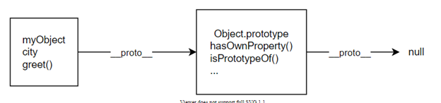
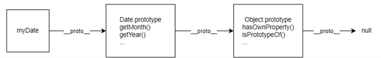

# Introducing JavaScript objects

- In JavaScript, most things are objects, from core JavaScript features like arrays to the browser APIs built on top of JavaScript.
- You can even create your own objects to encapsulate related functions and variables into efficient packages and act as handy data containers.
- The object-based nature of JavaScript is important to understand if you want to go further with your knowledge of the language, therefore we've provided this module to help you. Here we teach object theory and syntax in detail, then look at how to create your own objects.

# JavaScript object basics

- In this article, we'll look at fundamental JavaScript object syntax, and revisit some JavaScript features that we've already seen earlier in the course, reiterating the fact that many of the features you've already dealt with are objects.

## Object basics

- An object is a collection of related data and/or functionality. These usually consist of several variables and functions (which are called properties and methods when they are inside objects). Let's work through an example to understand what they look like.

- To begin with, make a local copy of our `oojs.html` file. This contains very little — a `<script>` element for us to write our source code into. We'll use this as a basis for exploring basic object syntax. While working with this example you should have your developer tools JavaScript console open and ready to type in some commands.

- As with many things in JavaScript, creating an object often begins with defining and initializing a variable. Try entering the following line below the JavaScript code that's already in your file, then saving and refreshing:

```
const person = {};
```

- Type the corresponding object into the console and you'll see:

```
[object Object]
Object { }
{ }
```

- Let's update the file with following:

```
const person = {
  name: ["Bob", "Smith"],
  age: 32,
  bio: function () {
    console.log(`${this.name[0]} ${this.name[1]} is ${this.age} years old.`);
  },
  introduceSelf: function () {
    console.log(`Hi! I'm ${this.name[0]}.`);
  },
};
```

- Typing the following and you'll see the corresponding information:

```
person.name;
person.name[0];
person.age;
person.bio();
person.introduceSelf();
```

- You have now got some data and functionality inside your object, and are now able to access them with some nice simple syntax!

- So what is going on here?
- Well, an object is made up of multiple members, each of which has a name (e.g. `name` and `age` above), and a value (e.g. `['Bob', 'Smith']` and `32`).
- Each name/value pair must be separated by a comma, and the name and value in each case are separated by a colon. The syntax always follows this pattern:

```
const objectName = {
  member1Name: member1Value,
  member2Name: member2Value,
  member3Name: member3Value,
};
```

- The value of an object member can be pretty much anything — in our person object we've got a number, an array, and two functions.
- The first two items are data items, and are referred to as the object's **properties**.
- The last two items are functions that allow the object to do something with that data, and are referred to as the object's **methods**.

- When the object's members are functions there's a simpler syntax. Instead of `bio: function ()` we can write `bio()`. Like this:

```
const person = {
  name: ["Bob", "Smith"],
  age: 32,
  bio() {
    console.log(`${this.name[0]} ${this.name[1]} is ${this.age} years old.`);
  },
  introduceSelf() {
    console.log(`Hi! I'm ${this.name[0]}.`);
  },
};
```

- An object like this is referred to as an **object literal** — we've literally written out the object contents as we've come to create it. This is different compared to objects instantiated from classes, which we'll look at later on.

- It is very common to create an object using an object literal when you want to transfer a series of structured, related data items in some manner, for example sending a request to the server to be put into a database. Sending a single object is much more efficient than sending several items individually, and it is easier to work with than an array, when you want to identify individual items by name.

## Dot notation

- Above, you accessed the object's properties and methods using **dot notation**.
- The object name (person) acts as the **namespace** — it must be entered first to access anything inside the object.
- Next you write a dot, then the item you want to access — this can be the name of a simple property, an item of an array property, or a call to one of the object's methods, for example:

```
person.age;
person.bio();
```

### Objects as object properties

- An object property can itself be an object. For example, try changing the name member from

```
const person = {
  name: ["Bob", "Smith"],
};
```

- to

```
const person = {
  name: {
    first: "Bob",
    last: "Smith",
  },
  // …
};
```

- To access these items you just need to chain the extra step onto the end with another dot. Try these in the JS console:

```
person.name.first;
person.name.last;
```

- If you do this, you'll also need to go through your method code and change any instances of

```
name[0];
name[1];
```

- to

```
name.first;
name.last;
```

- Otherwise, your methods will no longer work.

## Bracket notation

- Bracket notation provides an alternative way to access object properties. Instead of using dot notation like this:

```
person.age;
person.name.first;
```

- You can instead use brackets:

```
person["age"];
person["name"]["first"];
```

- This looks very similar to how you access the items in an array, and it is basically the same thing — instead of using an index number to select an item, you are using the name associated with each member's value.
- It is no wonder that objects are sometimes called **associative arrays** — they map strings to values in the same way that arrays map numbers to values.

- Dot notation is generally preferred over bracket notation because it is more succinct and easier to read.
- However there are some cases where you have to use brackets.
- For example, if an object property name is held in a variable, then you can't use dot notation to access the value, but you can access the value using bracket notation.

- In the example below, the `logProperty()` function can use `person[propertyName]` to retrieve the value of the property named in `propertyName`.

```
const person = {
  name: ["Bob", "Smith"],
  age: 32,
};

function logProperty(propertyName) {
  console.log(person[propertyName]);
}

logProperty("name");
// ["Bob", "Smith"]
logProperty("age");
// 32
```

## Setting object members

- So far we've only looked at retrieving (or **getting**) object members — you can also **set** (update) the value of object members by declaring the member you want to set (using dot or bracket notation), like this:

```
person.age = 45;
person["name"]["last"] = "Cratchit";
```

- Try entering the above lines, and then getting the members again to see how they've changed, like so:

```
person.age;
person["name"]["last"];
```

- Setting members doesn't just stop at updating the values of existing properties and methods; you can also create completely new members. Try these in the JS console:

```
person["eyes"] = "hazel";
person.farewell = function () {
  console.log("Bye everybody!");
};
```

- You can now test out your new members:

```
person["eyes"];
person.farewell();
```

- One useful aspect of bracket notation is that it can be used to set not only member values dynamically, but member names too. Let's say we wanted users to be able to store custom value types in their people data, by typing the member name and value into two text inputs. We could get those values like this:

```
const myDataName = nameInput.value;
const myDataValue = nameValue.value;
```

- We could then add this new member name and value to the `person` object like this:

```
person[myDataName] = myDataValue;
```

## What is "this"?

- You may have noticed something slightly strange in our methods. Look at this one for example:

```
introduceSelf() {
  console.log(`Hi! I'm ${this.name[0]}.`);
}
```

- You are probably wondering what "this" is.
- The `this` keyword refers to the current object the code is being written inside — so in this case `this` is equivalent to `person`.
- So why not just write `person` instead?

- Well, when you only have to create a single object literal, it's not so useful. But if you create more than one, `this` enables you to use the same method definition for every object you create.

- Let's illustrate what we mean with a simplified pair of person objects:

```
const person1 = {
  name: "Chris",
  introduceSelf() {
    console.log(`Hi! I'm ${this.name}.`);
  },
};

const person2 = {
  name: "Deepti",
  introduceSelf() {
    console.log(`Hi! I'm ${this.name}.`);
  },
};
```

- In this case, `person1.introduceSelf()` outputs "Hi! I'm Chris."; `person2.introduceSelf()` on the other hand outputs "Hi! I'm Deepti.", even though the method's code is exactly the same in each case.
- This isn't hugely useful when you are writing out object literals by hand, but it will be essential when we start using **constructors** to create more than one object from a single object definition, and that's the subject of the next section.

## Introducing constructors

- Using object literals is fine when you only need to create one object, but if you have to create more than one, as in the previous section, they're seriously inadequate. We have to write out the same code for every object we create, and if we want to change some properties of the object - like adding a `height` property - then we have to remember to update every object.

- We would like a way to define the "shape" of an object — the set of methods and the properties it can have — and then create as many objects as we like, just updating the values for the properties that are different.

- The first version of this is just a function:

```
function createPerson(name) {
  const obj = {};
  obj.name = name;
  obj.introduceSelf = function () {
    console.log(`Hi! I'm ${this.name}.`);
  };
  return obj;
}
```

- This function creates and returns a new object each time we call it. The object will have two members:

  - a property `name`
  - a method `introduceSelf()`.

- Note that `createPerson()` takes a parameter name to set the value of the name property, but the value of the `introduceSelf()` method will be the same for all objects created using this function. This is a very common pattern for creating objects.

- Now we can create as many objects as we like, reusing the definition:

```
const salva = createPerson("Salva");
salva.name;
salva.introduceSelf();

const frankie = createPerson("Frankie");
frankie.name;
frankie.introduceSelf();
```

- This works fine but is a bit long-winded: we have to create an empty object, initialize it, and return it. A better way is to use a **constructor**. A constructor is just a function called using the new keyword. When you call a constructor, it will:

  - create a new object
  - bind `this` to the new object, so you can refer to `this` in your constructor code
  - run the code in the constructor
  - return the new object.

- Constructors, by convention, start with a capital letter and are named for the type of object they create. So we could rewrite our example like this:

```
function Person(name) {
  this.name = name;
  this.introduceSelf = function () {
    console.log(`Hi! I'm ${this.name}.`);
  };
}
```

- To call `Person()` as a constructor, we use new:

```
const salva = new Person("Salva");
salva.name;
salva.introduceSelf();

const frankie = new Person("Frankie");
frankie.name;
frankie.introduceSelf();
```

## You've been using objects all along

- As you've been going through these examples, you have probably been thinking that the dot notation you've been using is very familiar. That's because you've been using it throughout the course! Every time we've been working through an example that uses a built-in browser API or JavaScript object, we've been using objects, because such features are built using exactly the same kind of object structures that we've been looking at here, albeit more complex ones than in our own basic custom examples.

So when you used string methods like:

```
myString.split(",");
```

- You were using a method available on a `String` object.
- Every time you create a string in your code, that string is automatically created as an instance of `String`, and therefore has several common methods and properties available on it.

- When you accessed the document object model using lines like this:

```
const myDiv = document.createElement("div");
const myVideo = document.querySelector("video");
```

- You were using methods available on a `Document` object. For each webpage loaded, an instance of `Document` is created, called `document`, which represents the entire page's structure, content, and other features such as its URL. Again, this means that it has several common methods and properties available on it.

The same is true of pretty much any other built-in object or API you've been using — `Array`, `Math`, and so on.

- Note that built in objects and APIs don't always create object instances automatically. As an example, the Notifications API — which allows modern browsers to fire system notifications — requires you to instantiate a new object instance using the constructor for each notification you want to fire. Try entering the following into your JavaScript console:

```
const myNotification = new Notification("Hello!");
```

# Object prototypes

- Prototypes are the mechanism by which JavaScript objects inherit features from one another. In this article, we explain what a prototype is, how prototype chains work, and how a prototype for an object can be set.

## The prototype chain

- In the browser's console, try creating an object literal:

```
const myObject = {
  city: "Madrid",
  greet() {
    console.log(`Greetings from ${this.city}`);
  },
};

myObject.greet(); // Greetings from Madrid
```

- This is an object with one data property, `city`, and one method, `greet()`.
- If you type the object's name followed by a period into the console, like `myObject.`, then the console will pop up a list of all the properties available to this object.
- You'll see that as well as `city` and `greet`, there are lots of other properties!

```
__defineGetter__
__defineSetter__
__lookupGetter__
__lookupSetter__
__proto__
city
constructor
greet
hasOwnProperty
isPrototypeOf
propertyIsEnumerable
toLocaleString
toString
valueOf
```

- Try accessing one of them:

```
myObject.toString(); // "[object Object]"
```

- It works (even if it's not obvious what `toString()` does).

- What are these extra properties, and where do they come from?

- Every object in JavaScript has a built-in property, which is called its **prototype**.
- The prototype is itself an object, so the prototype will have its own prototype, making what's called a **prototype chain**.
- The chain ends when we reach a prototype that has `null` for its own prototype.

- **Note**: The property of an object that points to its prototype is **not** called `prototype`.
- Its name is not standard, but in practice all browsers use `__proto__`.
- The standard way to access an object's prototype is the `Object.getPrototypeOf()` method.

- When you try to access a property of an object: if the property can't be found in the object itself, the prototype is searched for the property. If the property still can't be found, then the prototype's prototype is searched, and so on until either the property is found, or the end of the chain is reached, in which case `undefined` is returned.

- So when we call `myObject.toString()`, the browser:

  - looks for `toString` in `myObject`
  - can't find it there, so looks in the prototype object of `myObject` for `toString`
  - finds it there, and calls it.

- What is the prototype for `myObject`? To find out, we can use the function `Object.getPrototypeOf()`:

```
Object.getPrototypeOf(myObject); // Object { }
```

- This is an object called `Object.prototype`, and it is the most basic prototype, that all objects have by default.
- The prototype of `Object.prototype` is `null`, so it's at the end of the prototype chain:



- The prototype of an object is not always Object.prototype. Try this:

```
const myDate = new Date();
let object = myDate;

do {
  object = Object.getPrototypeOf(object);
  console.log(object);
} while (object);

// Date.prototype
// Object { }
// null
```

- This code creates a `Date` object, then walks up the prototype chain, logging the prototypes. It shows us that the prototype of `myDate` is a `Date.prototype` object, and the prototype of _that_ is `Object.prototype`.

- In fact, when you call familiar methods, like `myDate2.getMonth()`, you are calling a method that's defined on `Date.prototype`.



## Shadowing properties

- What happens if you define a property in an object, when a property with the same name is defined in the object's prototype? Let's see:

```
const myDate = new Date(1995, 11, 17);

console.log(myDate.getYear()); // 95

myDate.getYear = function () {
  console.log("something else!");
};

myDate.getYear(); // 'something else!'
```

- This should be predictable, given the description of the prototype chain. When we call `getYear()` the browser first looks in `myDate` for a property with that name, and only checks the prototype if `myDate` does not define it.
- So when we add `getYear()` to` myDate`, then the version in `myDate` is called.

- This is called "shadowing" the property.

## Setting a prototype

- There are various ways of setting an object's prototype in JavaScript, and here we'll describe two: `Object.create()` and constructors.

### Using Object.create

- The `Object.create()` method creates a new object and allows you to specify an object that will be used as the new object's prototype.

- Here's an example:

```
const personPrototype = {
  greet() {
    console.log("hello!");
  },
};

const carl = Object.create(personPrototype);
carl.greet(); // hello!
```

- Here we create an object `personPrototype`, which has a `greet()` method.
- We then use `Object.create()` to create a new object with `personPrototype` as its prototype.
- Now we can call `greet()` on the new object, and the prototype provides its implementation.

### Using a constructor

- In JavaScript, all functions have a property named `prototype`.
- When you call a function as a constructor, this property is set as the prototype of the newly constructed object (by convention, in the property named `__proto__`).

- So if we set the prototype of a constructor, we can ensure that all objects created with that constructor are given that prototype:

```
const personPrototype = {
  greet() {
    console.log(`hello, my name is ${this.name}!`);
  },
};

function Person(name) {
  this.name = name;
}

Object.assign(Person.prototype, personPrototype);
// or
// Person.prototype.greet = personPrototype.greet;
```

- Here we create:

  - an object `personPrototype`, which has a `greet()` method
  - a `Person()` constructor function which initializes the name of the person to create.

- We then put the methods defined in `personPrototype` onto the Person function's `prototype` property using Object.assign.

- After this code, objects created using `Person()` will get `Person.prototype` as their prototype, which automatically contains the `greet` method.

```
const reuben = new Person("Reuben");
reuben.greet(); // hello, my name is Reuben!
```

### Own properties

- The objects we create using the `Person` constructor above have two properties:

  - a `name` property, which is set in the constructor, so it appears directly on `Person` objects
  - a `greet()` method, which is set in the prototype.

- It's common to see this pattern, in which methods are defined on the prototype, but data properties are defined in the constructor. That's because methods are usually the same for every object we create, while we often want each object to have its own value for its data properties (just as here where every person has a different name).

- Properties that are defined directly in the object, like `name` here, are called **own properties**, and you can check whether a property is an own property using the static `Object.hasOwn()` method:

```
const irma = new Person("Irma");

console.log(Object.hasOwn(irma, "name")); // true
console.log(Object.hasOwn(irma, "greet")); // false
```

- **Note**: You can also use the non-static `Object.hasOwnProperty()` method here, but we recommend that you use `Object.hasOwn()` if you can.

## Prototypes and inheritance

- Prototypes are a powerful and very flexible feature of JavaScript, making it possible to reuse code and combine objects.

- In particular they support a version of **inheritance**. Inheritance is a feature of object-oriented programming languages that lets programmers express the idea that some objects in a system are more specialized versions of other objects.

- For example, if we're modeling a school, we might have professors and students: they are both people, so have some features in common (for example, they both have names), but each might add extra features (for example, professors have a subject that they teach), or might implement the same feature in different ways. In an OOP system we might say that professors and students both **inherit from** people.

- You can see how in JavaScript, if `Professor` and `Student` objects can have `Person` prototypes, then they can inherit the common properties, while adding and redefining those properties which need to differ.

- In the next article we'll discuss inheritance along with the other main features of object-oriented programming languages, and see how JavaScript supports them.

# Object-oriented programming

- Object-oriented programming (OOP) is a programming paradigm fundamental to many programming languages, including Java and C++. In this article, we'll provide an overview of the basic concepts of OOP.
- We'll describe three main concepts: **classes and instances**, **inheritance**, and **encapsulation**. For now, we'll describe these concepts without reference to JavaScript in particular, so all the examples are given in pseudocode.

- After that, in JavaScript, we'll look at how constructors and the prototype chain relate to these OOP concepts, and how they differ. In the next article, we'll look at some additional features of JavaScript that make it easier to implement object-oriented programs.

- Object-oriented programming is about modeling a system as a collection of objects, where each object represents some particular aspect of the system. Objects contain both functions (or methods) and data. An object provides a public interface to other code that wants to use it but maintains its own private, internal state; other parts of the system don't have to care about what is going on inside the object.

## Classes and instances

- When we model a problem in terms of objects in OOP, we create abstract definitions representing the types of objects we want to have in our system.
- For example, if we were modeling a school, we might want to have objects representing professors.
- Every professor has some properties in common: they all have a name and a subject that they teach.
- Additionally, every professor can do certain things: they can all grade a paper and they can introduce themselves to their students at the start of the year, for example.

- So `Professor` could be a **class** in our system. The definition of the class lists the data and methods that every professor has.

- In pseudocode, a `Professor` class could be written like this:

```
class Professor
    properties
        name
        teaches
    methods
        grade(paper)
        introduceSelf()
```

- This defines a `Professor` class with:

  - two data properties: `name` and `teaches`
  - two methods: `grade()` to grade a paper and `introduceSelf()` to introduce themselves.

- On its own, a class doesn't do anything: it's a kind of template for creating concrete objects of that type.
- Each concrete professor we create is called an **instance** of the `Professor` class.
- The process of creating an instance is performed by a special function called a **constructor**. We pass values to the constructor for any internal state that we want to initialize in the new instance.

- Generally, the constructor is written out as part of the class definition, and it usually has the same name as the class itself:

```
class Professor
    properties
        name
        teaches
    constructor
        Professor(name, teaches)
    methods
        grade(paper)
        introduceSelf()
```

- This constructor takes two parameters, so we can initialize the `name` and `teaches` properties when we create a new concrete professor.

- Now that we have a constructor, we can create some professors. Programming languages often use the keyword `new` to signal that a constructor is being called.

```
walsh = new Professor("Walsh", "Psychology");
lillian = new Professor("Lillian", "Poetry");

walsh.teaches; // 'Psychology'
walsh.introduceSelf(); // 'My name is Professor Walsh and I will be your Psychology professor.'

lillian.teaches; // 'Poetry'
lillian.introduceSelf(); // 'My name is Professor Lillian and I will be your Poetry professor.'
```

- This creates two objects, both instances of the Professor class.

## Inheritance

- Suppose in our school we also want to represent students. Unlike professors, students can't grade papers, don't teach a particular subject, and belong to a particular year.

- However, students do have a name and may also want to introduce themselves, so we might write out the definition of a student class like this:

```
class Student
    properties
        name
        year
    constructor
        Student(name, year)
    methods
        introduceSelf()
```

- It would be helpful if we could represent the fact that students and professors share some properties, or more accurately, the fact that on some level, they are the _same kind of thing_. **Inheritance** lets us do this.

- We start by observing that students and professors are both people, and people have names and want to introduce themselves. We can model this by defining a new class `Person`, where we define all the common properties of people. Then, `Professor` and `Student` can both derive from `Person`, adding their extra properties:

```
class Person
    properties
        name
    constructor
        Person(name)
    methods
        introduceSelf()

class Professor : extends Person
    properties
        teaches
    constructor
        Professor(name, teaches)
    methods
        grade(paper)
        introduceSelf()

class Student : extends Person
    properties
        year
    constructor
        Student(name, year)
    methods
        introduceSelf()
```

- In this case, we would say that `Person` is the **superclass** or **parent class** of both `Professor` and `Student`.
- Conversely, `Professor` and `Student` are **subclasses** or **child classes** of `Person`.

- You might notice that `introduceSelf()` is defined in all three classes. The reason for this is that while all people want to introduce themselves, the way they do so is different:

```
walsh = new Professor("Walsh", "Psychology");
walsh.introduceSelf(); // 'My name is Professor Walsh and I will be your Psychology professor.'

summers = new Student("Summers", 1);
summers.introduceSelf(); // 'My name is Summers and I'm in the first year.'
```

- We might have a default implementation of `introduceSelf()` for people who aren't students or professors:

```
pratt = new Person("Pratt");
pratt.introduceSelf(); // 'My name is Pratt.'
```

- This feature - when a method has the same name but a different implementation in different classes - is called **polymorphism**.
- When a method in a subclass replaces the superclass's implementation, we say that the subclass **overrides** the version in the superclass.

## Encapsulation

- Objects provide an interface to other code that wants to use them but maintain their own internal state.
- The object's internal state is kept **private**, meaning that it can only be accessed by the object's own methods, not from other objects.
- Keeping an object's internal state private, and generally making a clear division between its public interface and its private internal state, is called **encapsulation**.

- This is a useful feature because it enables the programmer to change the internal implementation of an object without having to find and update all the code that uses it: it creates a kind of firewall between this object and the rest of the system.

- For example, suppose students are allowed to study archery if they are in the second year or above. We could implement this just by exposing the student's year property, and other code could examine that to decide whether the student can take the course:

```
if (student.year > 1) {
  // allow the student into the class
}
```

- The problem is, if we decide to change the criteria for allowing students to study archery - for example by also requiring the parent or guardian to give their permission - we'd need to update every place in our system that performs this test.
- It would be better to have a `canStudyArchery()` method on Student objects, that implements the logic in one place:

```
class Student : extends Person
    properties
       year
    constructor
        Student(name, year)
    methods
       introduceSelf()
       canStudyArchery() { return this.year > 1 }
```

```
if (student.canStudyArchery()) {
  // allow the student into the class
}
```

- That way, if we want to change the rules about studying archery, we only have to update the `Student` class, and all the code using it will still work.

- In many OOP languages, we can prevent other code from accessing an object's internal state by marking some properties as `private`. This will generate an error if code outside the object tries to access them:

```
class Student : extends Person
    properties
       private year
    constructor
        Student(name, year)
    methods
       introduceSelf()
       canStudyArchery() { return this.year > 1 }

student = new Student('Weber', 1)
student.year // error: 'year' is a private property of Student
```

- In languages that don't enforce access like this, programmers use naming conventions, such as starting the name with an underscore, to indicate that the property should be considered private.

## OOP and JavaScript

- In this article, we've described some of the basic features of class-based object-oriented programming as implemented in languages like Java and C++.

- In the two previous articles, we looked at a couple of core JavaScript features: constructors and prototypes. These features certainly have some relation to some of the OOP concepts described above.

  - **constructors** in JavaScript provide us with something like a class definition, enabling us to define the "shape" of an object, including any methods it contains, in a single place.
    - But prototypes can be used here, too.
    - For example, if a method is defined on a constructor's prototype property, then all objects created using that constructor get that method via their prototype, and we don't need to define it in the constructor.
  - **the prototype chain** seems like a natural way to implement inheritance.
    - For example, if we can have a `Student` object whose prototype is `Person`, then it can inherit `name` and override `introduceSelf()`.

- But it's worth understanding the differences between these features and the "classical" OOP concepts described above. We'll highlight a couple of them here.

- First, in class-based OOP, classes and objects are two separate constructs, and objects are always created as instances of classes.
- Also, there is a distinction between the feature used to define a class (the class syntax itself) and the feature used to instantiate an object (a constructor).
- In JavaScript, we can and often do create objects without any separate class definition, either using a function or an object literal.
- This can make working with objects much more lightweight than it is in classical OOP.

- Second, although a prototype chain looks like an inheritance hierarchy and behaves like it in some ways, it's different in others.
- When a subclass is instantiated, a single object is created which combines properties defined in the subclass with properties defined further up the hierarchy.
- With prototyping, each level of the hierarchy is represented by a separate object, and they are linked together via the `__proto__` property.
- The prototype chain's behavior is less like inheritance and more like **delegation**.
- Delegation is a programming pattern where an object, when asked to perform a task, can perform the task itself or ask another object (its delegate) to perform the task on its behalf.
- In many ways, delegation is a more flexible way of combining objects than inheritance (for one thing, it's possible to change or completely replace the delegate at run time).

- That said, constructors and prototypes can be used to implement class-based OOP patterns in JavaScript.
- But using them directly to implement features like inheritance is tricky, so JavaScript provides extra features, layered on top of the prototype model, that map more directly to the concepts of class-based OOP. These extra features are the subject of the next article.

# Classes in JavaScript

- In the last section, we introduced some basic concepts of object-oriented programming (OOP), and discussed an example where we used OOP principles to model professors and students in a school.

- We also talked about how it's possible to use prototypes and constructors to implement a model like this, and that JavaScript also provides features that map more closely to classical OOP concepts.

- In this article, we'll go through these features. It's worth keeping in mind that the features described here are not a new way of combining objects: under the hood, they still use prototypes. They're just a way to make it easier to set up a prototype chain.

## Classes and constructors

- You can declare a `class` using the class keyword. Here's a class declaration for our `Person` from the previous article:

```
class Person {

  name;

  constructor(name) {
    this.name = name;
  }

  introduceSelf() {
    console.log(`Hi! I'm ${this.name}`);
  }

}
```

- This declares a class called `Person`, with:

  - a `name` property.
  - a constructor that takes a `name` parameter that is used to initialize the new object's `name` property
  - an `introduceSelf()` method that can refer to the object's properties using `this`.

- The `name;` declaration is optional: you could omit it, and the line `this.name = name;` in the constructor will create the `name` property before initializing it. However, listing properties explicitly in the class declaration might make it easier for people reading your code to see which properties are part of this class.

- You could also initialize the property to a default value when you declare it, with a line like `name = '';`.

- The constructor is defined using the `constructor` keyword. Just like a constructor outside a class definition, it will:

  - create a new object
  - bind `this` to the new object, so you can refer to `this` in your constructor code
  - run the code in the constructor
  - return the new object.

- Given the class declaration code above, you can create and use a new `Person` instance like this:

```
const giles = new Person('Giles');

giles.introduceSelf(); // Hi! I'm Giles
```

- Note that we call the constructor using the name of the class, `Person` in this example.

### Omitting constructors

- If you don't need to do any special initialization, you can omit the constructor, and a default constructor will be generated for you:

```
class Animal {

  sleep() {
    console.log('zzzzzzz');
  }

}

const spot = new Animal();

spot.sleep(); // 'zzzzzzz'
```

## Inheritance

- Given our `Person` class above, let's define the `Professor` subclass.

```
class Professor extends Person {

  teaches;

  constructor(name, teaches) {
    super(name);
    this.teaches = teaches;
  }

  introduceSelf() {
    console.log(`My name is ${this.name}, and I will be your ${this.teaches} professor.`);
  }

  grade(paper) {
    const grade = Math.floor(Math.random() * (5 - 1) + 1);
    console.log(grade);
  }

}
```

- We use the `extends` keyword to say that this class inherits from another class.

- The `Professor` class adds a new property `teaches`, so we declare that.

- Since we want to set `teaches` when a new `Professor` is created, we define a constructor, which takes the `name` and `teaches` as arguments.

  - The first thing this constructor does is call the superclass constructor using `super()`, passing up the `name` parameter.
  - The superclass constructor takes care of setting name. After that, the `Professor` constructor sets the `teaches` property.

- **Note**: If a subclass has any of its own initialization to do, it **must** first call the superclass constructor using `super()`, passing up any parameters that the superclass constructor is expecting.

- We've also overridden the `introduceSelf()` method from the superclass, and added a new method `grade()`, to grade a paper (our professor isn't very good, and just assigns random grades to papers).

- With this declaration we can now create and use professors:

```
const walsh = new Professor('Walsh', 'Psychology');
walsh.introduceSelf();  // 'My name is Walsh, and I will be your Psychology professor'

walsh.grade('my paper'); // some random grade
```

## Encapsulation

- Finally, let's see how to implement encapsulation in JavaScript. In the last article we discussed how we would like to make the `year` property of `Student` private, so we could change the rules about archery classes without breaking any code that uses the `Student` class.

- Here's a declaration of the `Student` class that does just that:

```
class Student extends Person {

  #year;

  constructor(name, year) {
    super(name);
    this.#year = year;
  }


  introduceSelf() {
    console.log(`Hi! I'm ${this.name}, and I'm in year ${this.#year}.`);
  }

  canStudyArchery() {
    return this.#year > 1;
  }

}
```

- In this class declaration, `#year` is a private data property. We can construct a `Student` object, and it can use `#year` internally, but if code outside the object tries to access `#year` the browser throws an error:

```
const summers = new Student('Summers', 2);

summers.introduceSelf(); // Hi! I'm Summers, and I'm in year 2.
summers.canStudyArchery(); // true

summers.#year; // SyntaxError
```

- Private data properties must be declared in the class declaration, and their names start with `#`.

### Private methods

- You can have private methods as well as private data properties. Just like private data properties, their names start with `#`, and they can only be called by the object's own methods:

```
class Example {
  somePublicMethod() {
    this.#somePrivateMethod();
  }

  #somePrivateMethod() {
    console.log('You called me?');
  }
}

const myExample = new Example();

myExample.somePublicMethod(); // 'You called me?'

myExample.#somePrivateMethod(); // SyntaxError
```

# Working with JSON

- JavaScript Object Notation (JSON) is a standard text-based format for representing structured data based on JavaScript object syntax.
- It is commonly used for transmitting data in web applications (e.g., sending some data from the server to the client, so it can be displayed on a web page, or vice versa).
- You'll come across it quite often, so in this article, we give you all you need to work with JSON using JavaScript, including parsing JSON so you can access data within it, and creating JSON.

## No, really, what is JSON?

- JSON is a text-based data format following JavaScript object syntax, which was popularized by Douglas Crockford. Even though it closely resembles JavaScript object literal syntax, it can be used independently from JavaScript, and many programming environments feature the ability to read (parse) and generate JSON.

- JSON exists as a string — useful when you want to transmit data across a network. It needs to be converted to a native JavaScript object when you want to access the data. This is not a big issue — JavaScript provides a global JSON object that has methods available for converting between the two.

- **Note**: Converting a string to a native object is called _deserialization_, while converting a native object to a string so it can be transmitted across the network is called _serialization_.

- A JSON string can be stored in its own file, which is basically just a text file with an extension of `.json`, and a MIME type of `application/json`.

### JSON structure

- As described above, JSON is a string whose format very much resembles JavaScript object literal format. You can include the same basic data types inside JSON as you can in a standard JavaScript object — strings, numbers, arrays, booleans, and other object literals. This allows you to construct a data hierarchy, like so:

```
{
  "squadName": "Super hero squad",
  "homeTown": "Metro City",
  "formed": 2016,
  "secretBase": "Super tower",
  "active": true,
  "members": [
    {
      "name": "Molecule Man",
      "age": 29,
      "secretIdentity": "Dan Jukes",
      "powers": ["Radiation resistance", "Turning tiny", "Radiation blast"]
    },
    {
      "name": "Madame Uppercut",
      "age": 39,
      "secretIdentity": "Jane Wilson",
      "powers": [
        "Million tonne punch",
        "Damage resistance",
        "Superhuman reflexes"
      ]
    },
    {
      "name": "Eternal Flame",
      "age": 1000000,
      "secretIdentity": "Unknown",
      "powers": [
        "Immortality",
        "Heat Immunity",
        "Inferno",
        "Teleportation",
        "Interdimensional travel"
      ]
    }
  ]
}
```

- If we loaded this string into a JavaScript program and parsed it into a variable called superHeroes for example, we could then access the data inside it using the same dot/bracket notation we looked at in the JavaScript object basics article. For example:

```
superHeroes.homeTown
superHeroes['active']
```

- To access data further down the hierarchy, you have to chain the required property names and array indexes together. For example, to access the third superpower of the second hero listed in the members list, you'd do this:

```
superHeroes['members'][1]['powers'][2]
```

### Arrays as JSON

- Above we mentioned that JSON text basically looks like a JavaScript object inside a string. We can also convert arrays to/from JSON. Below is also valid JSON, for example:

```
[
  {
    "name": "Molecule Man",
    "age": 29,
    "secretIdentity": "Dan Jukes",
    "powers": ["Radiation resistance", "Turning tiny", "Radiation blast"]
  },
  {
    "name": "Madame Uppercut",
    "age": 39,
    "secretIdentity": "Jane Wilson",
    "powers": [
      "Million tonne punch",
      "Damage resistance",
      "Superhuman reflexes"
    ]
  }
]
```

- The above is perfectly valid JSON. You'd just have to access array items (in its parsed version) by starting with an array index, for example `[0]["powers"][0]`.

### Other notes

- JSON is purely a string with a specified data format — it contains only properties, no methods.
- JSON requires double quotes to be used around strings and property names. **Single quotes are not valid other than surrounding the entire JSON string**.
- Even a single misplaced comma or colon can cause a JSON file to go wrong, and not work. You should be careful to validate any data you are attempting to use (although computer-generated JSON is less likely to include errors, as long as the generator program is working correctly). You can validate JSON using an application like JSONLint.
- JSON can actually take the form of any data type that is valid for inclusion inside JSON, not just arrays or objects. So for example, a single string or number would be valid JSON.
- Unlike in JavaScript code in which object properties may be unquoted, in JSON only quoted strings may be used as properties.

## Active learning

- We will work through a sample example.

### Top-level function

- The top-level function looks like this:

```
async function populate() {

  const requestURL = 'https://mdn.github.io/learning-area/javascript/oojs/json/superheroes.json';
  const request = new Request(requestURL);

  const response = await fetch(request);
  const superHeroes = await response.json();

  populateHeader(superHeroes);
  populateHeroes(superHeroes);

}
```

- To obtain the JSON, we use an API called Fetch.
- This API allows us to make network requests to retrieve resources from a server via JavaScript (e.g. images, text, JSON, even HTML snippets), meaning that we can update small sections of content without having to reload the entire page.

- In our function, the first four lines use the Fetch API to fetch the JSON from the server:

  - we declare the `requestURL` variable to store the GitHub URL
  - we use the URL to initialize a new `Request` object.
  - we make the network request using the `fetch()` function, and this returns a `Response` object
  - we retrieve the response as JSON using the `json()` function of the `Response` object.

- **Note**: The `fetch()` API is **asynchronous**. We'll learn a lot about asynchronous functions in the next module, but for now, we'll just say that we need to add the keyword `async` before the name of the function that uses the fetch API, and add the keyword `await` before the calls to any asynchronous functions.

- After all that, the `superHeroes` variable will contain the JavaScript object based on the JSON.
- We are then passing that object to two function calls — the first one fills the `<header>` with the correct data, while the second one creates an information card for each hero on the team, and inserts it into the `<section>`.

### Populating the header

- Now that we've retrieved the JSON data and converted it into a JavaScript object, let's make use of it by writing the two functions we referenced above. First of all, add the following function definition below the previous code:

```
function populateHeader(obj) {
  const header = document.querySelector('header');
  const myH1 = document.createElement('h1');
  myH1.textContent = obj.squadName;
  header.appendChild(myH1);

  const myPara = document.createElement('p');
  myPara.textContent = `Hometown: ${obj.homeTown} // Formed: ${obj.formed}`;
  header.appendChild(myPara);
}
```

- Here we first create an `<h1>` element with `createElement()`, set its `textContent` to equal the `squadName` property of the object, then append it to the header using `appendChild()`.
- We then do a very similar operation with a paragraph: create it, set its text content and append it to the header.
- The only difference is that its text is set to a template literal containing both the `homeTown` and `formed` properties of the object.

### Creating the hero information cards

- Next, add the following function at the bottom of the code, which creates and displays the superhero cards:

```
function populateHeroes(obj) {
  const section = document.querySelector('section');
  const heroes = obj.members;

  for (const hero of heroes) {
    const myArticle = document.createElement('article');
    const myH2 = document.createElement('h2');
    const myPara1 = document.createElement('p');
    const myPara2 = document.createElement('p');
    const myPara3 = document.createElement('p');
    const myList = document.createElement('ul');

    myH2.textContent = hero.name;
    myPara1.textContent = `Secret identity: ${hero.secretIdentity}`;
    myPara2.textContent = `Age: ${hero.age}`;
    myPara3.textContent = 'Superpowers:';

    const superPowers = hero.powers;
    for (const power of superPowers) {
      const listItem = document.createElement('li');
      listItem.textContent = power;
      myList.appendChild(listItem);
    }

    myArticle.appendChild(myH2);
    myArticle.appendChild(myPara1);
    myArticle.appendChild(myPara2);
    myArticle.appendChild(myPara3);
    myArticle.appendChild(myList);

    section.appendChild(myArticle);
  }
}
```

- To start with, we store the `members` property of the JavaScript object in a new variable. This array contains multiple objects that contain the information for each hero.

Next, we use a `for...of` loop to loop through each object in the array. For each one, we:

1. Create several new elements: an `<article>`, an `<h2>`, three `<p>`s, and a `<ul>`.
2. Set the `<h2>` to contain the current hero's name.
3. Fill the three paragraphs with their `secretIdentity`, `age`, and a line saying "Superpowers:" to introduce the information in the list.
4. Store the `powers` property in another new constant called `superPowers` — this contains an array that lists the current hero's superpowers.
5. Use another `for...of` loop to loop through the current hero's superpowers — for each one we create an `<li>` element, put the superpower inside it, then put the `listItem` inside the `<ul>` element (`myList`) using `appendChild()`.
6. The very last thing we do is to append the `<h2>`, `<p>`s, and `<ul>` inside the `<article>` (`myArticle`), then append the `<article>` inside the `<section>`. The order in which things are appended is important, as this is the order they will be displayed inside the HTML.

### Calling the top-level function

- Finally, we need to call our top-level `populate()` function:

```
populate();
```

## Converting between objects and text

- The above example was simple in terms of accessing the JavaScript object, because we converted the network response directly into a JavaScript object using `response.json()`.

- But sometimes we aren't so lucky — sometimes we receive a raw JSON string, and we need to convert it to an object ourselves. And when we want to send a JavaScript object across the network, we need to convert it to JSON (a string) before sending it. Luckily, these two problems are so common in web development that a built-in JSON object is available in browsers, which contains the following two methods:

  - `parse()`: Accepts a JSON string as a parameter, and returns the corresponding JavaScript object.
  - `stringify()`: Accepts an object as a parameter, and returns the equivalent JSON string.

- You can see the first one in action in our heroes-finished-json-parse.html example (see the source code) — this does exactly the same thing as the example we built up earlier, except that:

  - we retrieve the response as text rather than JSON, by calling the `text()` method of the response
  - we then use `parse()` to convert the text to a JavaScript object.

- The key snippet of code is here:

```
async function populate() {

  const requestURL = 'https://mdn.github.io/learning-area/javascript/oojs/json/superheroes.json';
  const request = new Request(requestURL);

  const response = await fetch(request);
  const superHeroesText = await response.text();

  const superHeroes = JSON.parse(superHeroesText);
  populateHeader(superHeroes);
  populateHeroes(superHeroes);

}
```

- As you might guess, stringify() works the opposite way. Try entering the following lines into your browser's JavaScript console one by one to see it in action:

```
let myObj = { name: "Chris", age: 38 };
myObj
let myString = JSON.stringify(myObj);
myString
```

- Here we're creating a JavaScript object, then checking what it contains, then converting it to a JSON string using `stringify()` — saving the return value in a new variable — then checking it again.

# Object building practice

- In previous articles we looked at all the essential JavaScript object theory and syntax details, giving you a solid base to start from. In this article we dive into a practical exercise, giving you some more practice in building custom JavaScript objects, with a fun and colorful result.

## Animating the ball

- We start working with this piece of code:

```
function loop() {
  ctx.fillStyle = "rgba(0, 0, 0, 0.25)";
  ctx.fillRect(0, 0, width, height);

  for (const ball of balls) {
    ball.draw();
    ball.update();
  }

  requestAnimationFrame(loop);
}
```

- All programs that animate things generally involve an animation loop, which serves to update the information in the program and then render the resulting view on each frame of the animation; this is the basis for most games and other such programs. Our `loop()` function does the following:

  - Sets the canvas fill color to semi-transparent black, then draws a rectangle of the color across the whole width and height of the canvas, using `fillRect()` (the four parameters provide a start coordinate, and a width and height for the rectangle drawn).
    - This serves to cover up the previous frame's drawing before the next one is drawn.
    - If you don't do this, you'll just see long snakes worming their way around the canvas instead of balls moving!
    - The color of the fill is set to semi-transparent, rgba(0,0,0,0.25), to allow the previous few frames to shine through slightly, producing the little trails behind the balls as they move. If you changed 0.25 to 1, you won't see them at all any more. Try varying this number to see the effect it has.
  - Loops through all the balls in the `balls` array, and runs each ball's `draw()` and `update()` function to draw each one on the screen, then do the necessary updates to position and velocity in time for the next frame.
  - Runs the function again using the `requestAnimationFrame()` method — when this method is repeatedly run and passed the same function name, it runs that function a set number of times per second to create a smooth animation.
    - This is generally done recursively — which means that the function is calling itself every time it runs, so it runs over and over again.

- Finally, add the following line to the bottom of your code — we need to call the function once to get the animation started.

```
loop();
```

- That's it for the basics — try saving and refreshing to test your bouncing balls out!

## Adding collision detection

- Now for a bit of fun, let's add some collision detection to our program, so our balls know when they have hit another ball.

```
collisionDetect() {
  for (const ball of balls) {
    if (this !== ball) {
      const dx = this.x - ball.x;
      const dy = this.y - ball.y;
      const distance = Math.sqrt(dx * dx + dy * dy);

      if (distance < this.size + ball.size) {
        ball.color = this.color = randomRGB();
      }
    }
  }
}
```

- This method is a little complex, so don't worry if you don't understand exactly how it works for now. An explanation follows:
  - For each ball, we need to check every other ball to see if it has collided with the current ball. To do this, we start another `for...of` loop to loop through all the balls in the `balls[]` array.
  - Immediately inside the for loop, we use an `if` statement to check whether the current ball being looped through is the same ball as the one we are currently checking.
    - We don't want to check whether a ball has collided with itself! To do this, we check whether the current ball (i.e., the ball whose `collisionDetect` method is being invoked) is the same as the loop ball (i.e., the ball that is being referred to by the current iteration of the for loop in the collisionDetect method).
    - We then use `!` to negate the check, so that the code inside the if statement only runs if they are **not** the same.
  - We then use a common algorithm to check the collision of two circles. We are basically checking whether any of the two circle's areas overlap. This is explained further in 2D collision detection.
  - If a collision is detected, the code inside the inner `if` statement is run.
    - In this case, we only set the `color` property of both the circles to a new random color. We could have done something far more complex, like get the balls to bounce off each other realistically, but that would have been far more complex to implement.
    - For such physics simulations, developers tend to use a games or physics libraries such as PhysicsJS, matter.js, Phaser, etc.
